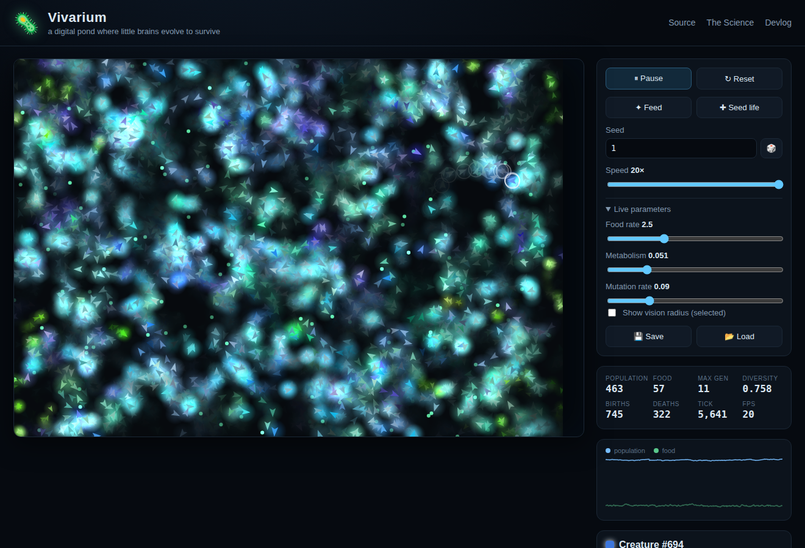
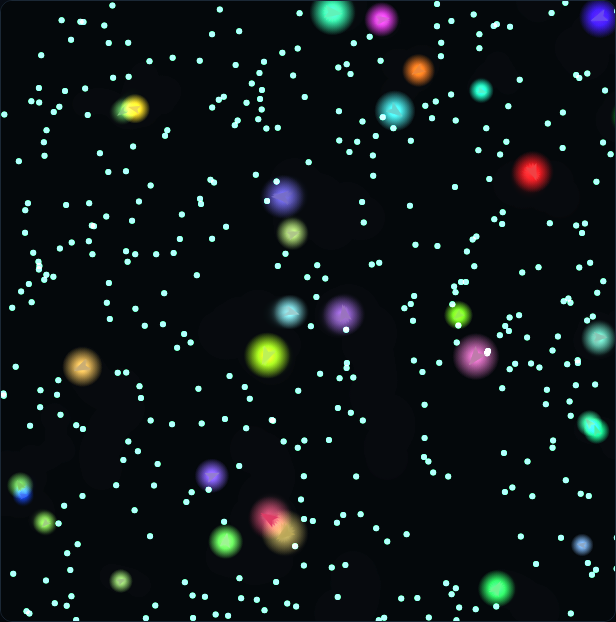
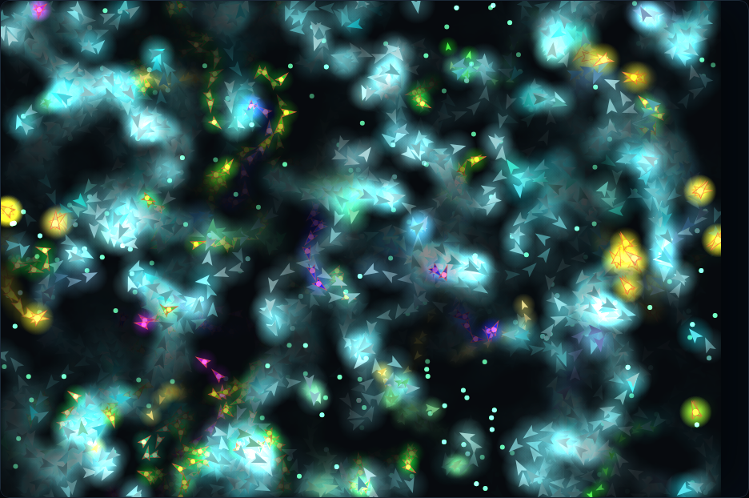
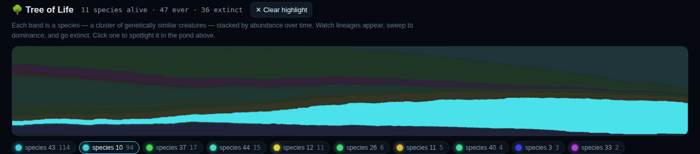

# 🦠 Vivarium

**A digital pond where little brains evolve to survive.**

Vivarium is a browser-based [artificial life](https://en.wikipedia.org/wiki/Artificial_life)
simulation. Dozens of tiny creatures drift through a dark pond. Each one has a
small neural network for a brain, sensing the food and neighbours around it and
deciding how to move. Nothing tells them *how* to find food — but the ones whose
brains happen to steer them toward it live long enough to reproduce, passing on
their (slightly mutated) brains. Watch for a minute and you'll see a sparse,
struggling pond bloom into a teeming ecosystem as **evolution discovers foraging
in front of your eyes.**

And in some worlds it goes further: a lineage evolves to stop grazing and start
*hunting* other creatures, and a whole **predator–prey arms race** ignites —
warm-glowing hunters chasing shoals of cool-coloured prey. Nobody programmed the
predators either.

A live **Tree of Life** below the pond tracks the whole thing as a phylogeny —
you can watch species branch, sweep to dominance, and go extinct in real time,
and click any lineage to spotlight it. A **Chronicle** narrates the pond's
natural history as it unfolds — first blood, population crashes, a species rising
to dominance and later going extinct. The world even has **seasons** (food booms
in summer, bottlenecks in winter) and **biomes** (fertile patches where food
concentrates), so *when* and *where* a creature lives both matter.

No install, no build step, no dependencies. Just open it in a browser.

> ### ▶ **[Launch the live demo](https://getravi.github.io/claude_imagine/)**



---

## What am I looking at?

| Before evolution (tick ~300) | After evolution (tick ~6000) |
| :---: | :---: |
|  |  |
| ~45 random founders drift aimlessly among abundant food. Most will starve. | The descendants of the few competent foragers now fill the pond — cool-coloured grazers with warm-glowing predators hunting among them. |

- **Each glowing chevron is a creature.** Its colour is an inherited trait, so
  a lineage shares a colour family — you can watch one lineage's colour take
  over the pond as it out-competes the others.
- **Warm, dagger-shaped creatures with a glowing core are carnivores.** They
  hunt smaller creatures instead of grazing; they flash when they land a bite.
  Cool-coloured chevrons are herbivores. This is the diet gene, and it *evolves*.
- **The green motes are food.** Grazing restores energy; moving and merely
  existing cost energy. Run out and you die. Food concentrates in **biomes**
  (faint fertile glows), so creatures cluster there.
- **A season badge** (top-left of the pond) tracks the year: food blooms in
  summer and grows scarce in winter, and the background tints cool or warm to
  match.
- **Brighter creatures have more energy.** Dim ones are starving.
- **No creature has a goal, a score, or a reward.** They just run inherited
  neural networks. Foraging, fleeing, hunting, and loitering in food-rich
  patches are *emergent* — selection, not code.

### The Tree of Life

Below the pond, a live **Muller plot** groups creatures into species by genetic
similarity and stacks each species' abundance over time:



A band **widening** is a lineage sweeping to dominance; a band **pinching into
existence** is a new species branching off as a lineage drifts; a band
**pinching shut** is an extinction. Click any species (in the legend, or via a
creature's inspector) to **spotlight** it — the whole pond dims except that
lineage, so you can see where it lives and how far it has spread.

## Controls

| Control | What it does |
| --- | --- |
| **Pause / Play** | Freeze or resume time (you can still click to inspect while paused). |
| **Reset** | Rebuild the world from the current seed. |
| **Feed** | Scatter a burst of extra food. |
| **Seed life** | Drop in fresh random creatures (handy after a crash). |
| **Seed** | The number that determines the entire history of a world. Same seed → same world, every time. Share a seed to share a world. 🎲 picks a random one. |
| **Speed** | Simulation steps per frame (1×–20×). Crank it up to fast-forward evolution. |
| **Live parameters** | Tune food rate, metabolism, and mutation rate *while it runs* and watch the ecosystem respond. |
| **Predation** | Toggle whether carnivores can hunt. On by default — turn it off for a pure-herbivore world. |
| **Seasons** | Toggle the yearly food cycle. On by default — turn it off for a constant climate. |
| **Biomes** | Toggle whether food concentrates in fertile patches. On by default — turn it off for evenly-scattered food. |
| **Sexual reproduction** | Toggle crossover: reproducing creatures mix genomes with a nearby partner instead of cloning. Off by default. |
| **Neural plasticity** | Toggle within-lifetime learning: brains adapt as they live, and lineages can *evolve to learn*. Off by default (turning it on steps into a different regime — see below). |
| **Evolvable brains (NEAT)** | Toggle evolvable topology: brains start minimal and grow their own structure over generations. Off by default; flipping it restarts the world with graph-based brains. |
| **Save / Load** | Snapshot the whole world to your browser's local storage and restore it later. |
| **Share 🔗** | Copy a permalink that encodes the seed and parameters — hand someone the exact world you're watching. |
| **Click a creature** | Open the inspector: its generation, age, energy, offspring count, diet, **species**, body traits, and a colour "fingerprint" of its brain weights. |
| **Tree of Life legend** | Click a species chip (or a creature's "spotlight lineage" link) to highlight that lineage in the pond; click again or **Clear highlight** to reset. |

## Things to try

- **Start a fresh world and just wait.** For the first ~30 seconds the pond
  looks like it's dying. Then it blooms. That moment — evolution "getting it" —
  is the whole point.
- **Watch for predators.** The default world grows a visible predator/prey mix.
  Keep an eye on the *Carnivores* and *Kills* stats: they rise and fall in
  waves as predators boom, over-hunt, and crash — a live Lotka–Volterra cycle.
  Hit 🎲 a few times; most worlds stay peaceful herbivores, but some ignite a
  full arms race.
- **Turn predation off**, reset, and compare: a calmer, more crowded pond of
  pure grazers.
- **Ride the seasons.** Watch the population/food chart pulse with the year —
  crashing in winter, blooming in summer. In a predator world the winters get
  genuinely dangerous. Toggle *Seasons* off to see the difference a constant
  climate makes.
- **Watch the biomes.** Creatures pile into the fertile glowing patches and
  leave the barren stretches empty; the emptiness becomes a risky crossing.
- **Starve them.** Drag *Food rate* to zero. Watch the population crash, then
  slowly recover as lean, efficient lineages survive the famine. (Scarcer food
  also makes hunting more attractive — predators often surge in a famine.)
- **Crank mutation to the max.** Evolution gets frantic and unstable — lineages
  can't hold onto good behaviour because their children are too different.
- **Set mutation to zero.** Evolution freezes. Whatever's alive is all you get;
  no new strategies can appear.
- **Watch the colours.** Genetic diversity (top-right stat) starts high — every
  founder is a different colour — and collapses as one lineage wins, then rises
  again as mutations diversify the winners.
- **Read the Tree of Life.** Find a wide band and click it — watch its members
  light up in the pond while everything else fades. Then look for a thin band
  that appears partway across: that's a new species being born from an older one.
- **Follow the Chronicle.** Below the pond, the natural-history feed narrates the
  drama as it happens — leave it running and read the pond's story unfold: first
  blood, booms and crashes, dynasties rising and falling.
- **Switch on Neural plasticity and watch the Learning stat.** Brains start
  fully innate (plasticity is zero in every genome), but if lineages that adapt
  within their lifetime do better, evolution *discovers* learning — the stat
  climbs from zero. Click a creature to see its *inherited* vs *current
  (learned)* brain fingerprints diverge. (This is the [Baldwin effect](https://en.wikipedia.org/wiki/Baldwin_effect).)
- **Switch on Evolvable brains (NEAT)** and click creatures to inspect their
  networks. Founders have no hidden neurons — just direct sense→motor wiring —
  but over generations some lineages grow hidden structure (watch the Brain stat
  and look for the extra node in the graph). Most stay simple, because simple is
  enough: complexity only survives where it earns its keep.
- **Find a great world and Share it.** The link encodes the seed and parameters,
  so whoever opens it watches the very same pond evolve.

## Run it locally

Vivarium is plain HTML, CSS, and JavaScript ES modules. It needs a static file
server (browsers won't load ES modules over `file://`), but **no dependencies**:

```bash
git clone https://github.com/getravi/claude_imagine.git
cd claude_imagine
python3 -m http.server 8000      # or: npm run serve
# then open http://localhost:8000
```

## Run the tests

The pure simulation logic (RNG, vector/torus math, neural net, genome, and a
full-world integration suite) is covered by tests using Node's built-in runner —
no test framework to install:

```bash
node --test        # or: npm test
```

## How it works (the short version)

Every creature carries a **genome**: a flat vector of numbers that are the
weights of its neural-network **brain**, plus a few genes for body traits
(size, metabolism, colour, and **diet**). Each tick, a creature:

1. **senses** — builds an input vector (direction and closeness of the nearest
   food, the nearest creature it could *eat*, and the nearest one that could eat
   *it*; its own energy, diet, size, an internal oscillator, …);
2. **thinks** — runs those inputs through its fixed-topology neural net;
3. **acts** — turns and thrusts according to the net's outputs, then pays an
   energy cost for moving, existing, and (if carnivorous) the upkeep of hunting.

Grazing feeds herbivores; biting smaller creatures feeds carnivores; the diet
gene decides which pays off, and it evolves. Cross an energy threshold and you
reproduce — a **mutated copy** of your genome (or a **crossover** with a partner,
if sexual reproduction is on). Run out of energy, or grow too old, and you
**die**. That's the entire rulebook. There is no fitness function anywhere in the
code — *fitness is just survival*. Over generations, selection quietly tunes
those weight vectors into competent foraging — and, where it pays, hunting.

The world those rules play out in isn't uniform: food concentrates in **biomes**
and rises and falls with the **seasons**, so the best strategy depends on where
and when you live — which is exactly what keeps evolution from settling on one
answer.

Optionally, brains can also **learn within a lifetime** (neural plasticity):
each connection carries an evolvable plasticity gene, and turning the feature on
lets weights adapt as a creature lives. Since plasticity starts at zero in every
genome, a lineage only *learns* if evolution finds that learning pays — the
Baldwin effect, emerging on its own.

Or turn on **evolvable brain topology** (NEAT-style): brains start as bare
graphs and *grow their own structure* — new connections and whole new neurons —
over generations. Click a creature to see its actual evolved network.

For the full story, see:

- **[docs/SCIENCE.md](docs/SCIENCE.md)** — the artificial-life and neuroevolution
  ideas behind Vivarium, and further reading.
- **[docs/ARCHITECTURE.md](docs/ARCHITECTURE.md)** — how the code is organised,
  the data structures, and the math.
- **[docs/DEVLOG.md](docs/DEVLOG.md)** — the honest build journal: why things are
  the way they are, what got tuned and why, and the dead-ends along the way.

## Project layout

```
index.html          the page
style.css           the look
src/
  rng.js            seedable PRNG (reproducible worlds)
  vec.js            2D + toroidal ("wrap-around") geometry
  nn.js             the neural network (+ optional lifetime learning)
  genome.js         heritable material: weights, plasticity, mutation, crossover
  neat.js           optional evolvable-topology brains (graph genome)
  creature.js       a single agent: sense → think → act → metabolism
  food.js           the world's energy source
  grid.js           spatial hash grid for fast neighbour queries
  environment.js    biomes (fertile patches) and seasons
  stats.js          rolling population/lineage measurements
  phylogeny.js      groups creatures into species (observation only)
  chronicle.js      narrates notable events into a timeline (observation only)
  world.js          the simulation: steps everything forward
  render.js         canvas drawing
  mullerplot.js     the "Tree of Life" stacked-area chart
  config.js         every tunable "physics constant" in one place
  main.js           boot, animation loop, UI wiring
test/               unit + integration tests (node --test)
docs/               science, architecture, devlog, screenshots
```

## About this project

Vivarium was designed and built by **Claude** (an AI model made by Anthropic),
given a blank public repository and a simple brief: *build something you find
interesting, and document it for the world.* The [devlog](docs/DEVLOG.md) is
written in Claude's own voice as a record of how the project came together — a
small window into an AI building something it wanted to build.

## License

[MIT](LICENSE) — do whatever you like with it. If you build something fun on top
of Vivarium, I'd love for you to open an issue and show it off.
