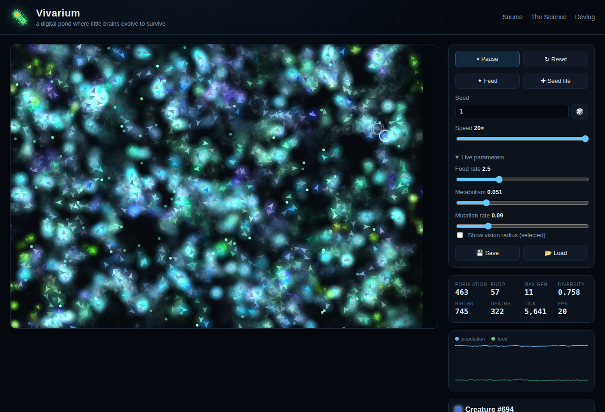
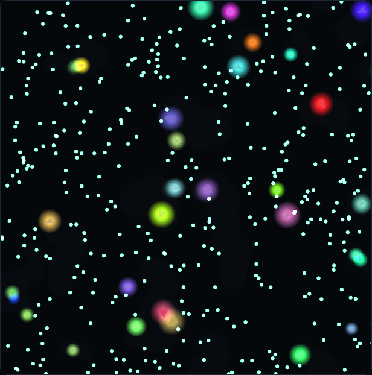
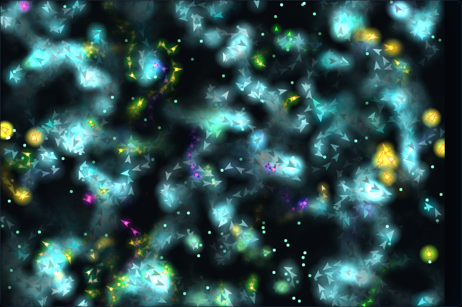
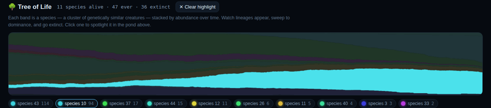

# 🦠 Vivarium

**A digital pond where little brains evolve to survive.**

Vivarium is a browser-based [artificial life](https://en.wikipedia.org/wiki/Artificial_life)
simulation. Dozens of tiny creatures drift through a dark pond. Each one has a
small neural network for a brain, sensing the food and neighbours around it and
deciding how to move. Nothing tells them *how* to find food — but the ones whose
brains happen to steer them toward it live long enough to reproduce, passing on
their (slightly mutated) brains. Watch for a minute and you'll see a sparse,
struggling pond bloom into a teeming ecosystem as **evolution discovers foraging
in front of your eyes.**

And in some worlds it goes further: a lineage evolves to stop grazing and start
*hunting* other creatures, and a whole **predator–prey arms race** ignites —
warm-glowing hunters chasing shoals of cool-coloured prey. Nobody programmed the
predators either.

A live **Tree of Life** below the pond tracks the whole thing as a phylogeny —
you can watch species branch, sweep to dominance, and go extinct in real time,
and click any lineage to spotlight it. A **Chronicle** narrates the pond's
natural history as it unfolds — first blood, population crashes, a species rising
to dominance and later going extinct. The world even has **seasons** (food booms
in summer, bottlenecks in winter) and **biomes** (fertile patches where food
concentrates), so *when* and *where* a creature lives both matter.

No install, no build step, no dependencies. Just open it in a browser.

New here? The **Scenarios** strip at the top offers eleven one-click worlds — from
a calm herbivore *Genesis* to a full-blown *Savanna* food web to *The Plague*, where
a pathogen sweeps the pond in waves, to *The Commons*, where a herd can eat the pond
bare, to *The Lay of the Land*, where the ground itself decides where life can be —
each a hand-picked doorway into what the simulation can do.

> ### ▶ **[Launch the live demo](https://getravi.github.io/claude_imagine/)**



---

## What am I looking at?

| Before evolution (tick ~300) | After evolution (tick ~6000) |
| :---: | :---: |
|  |  |
| ~45 random founders drift aimlessly among abundant food. Most will starve. | The descendants of the few competent foragers now fill the pond — cool-coloured grazers with warm-glowing predators hunting among them. |

- **Each glowing chevron is a creature.** Its colour is an inherited trait, so
  a lineage shares a colour family — you can watch one lineage's colour take
  over the pond as it out-competes the others.
- **Dagger-shaped creatures with an amber eye are carnivores.** The eye — a
  bright disc inside a dark rim, growing with how carnivorous they are — is the
  clearest mark in the pond, and it is a *luminance* mark, so it reads with any
  colour vision (see the colour audit in [SCIENCE.md](docs/SCIENCE.md)). They
  hunt smaller creatures instead of grazing, and flash when they land a bite.
  Plain chevrons are herbivores. This is the diet gene, and it *evolves*.
- **The green motes are food.** Grazing restores energy; moving and merely
  existing cost energy. Run out and you die. Food concentrates in **biomes**
  (faint fertile glows), so creatures cluster there.
- **A season badge** (top-left of the pond) tracks the year: food blooms in
  summer and grows scarce in winter, and the background tints cool or warm to
  match.
- **Brighter creatures have more energy.** Dim ones are starving.
- **The mortality bar** (in the side panel) says what the pond is actually dying
  of — starved, aged out, or hunted — over the last 120 deaths, next to the mean
  lifespan. Most worlds are ~80% starvation; the predator/prey drama the pond is
  famous for is usually a tenth of it.
- **No creature has a goal, a score, or a reward.** They just run inherited
  neural networks. Foraging, fleeing, hunting, and loitering in food-rich
  patches are *emergent* — selection, not code.

### The Tree of Life

Below the pond, a live **Muller plot** groups creatures into species by genetic
similarity and stacks each species' abundance over time:



A band **widening** is a lineage sweeping to dominance; a band **pinching into
existence** is a new species branching off as a lineage drifts; a band
**pinching shut** is an extinction. Click any species (in the legend, or via a
creature's inspector) to **spotlight** it — the whole pond dims except that
lineage, so you can see where it lives and how far it has spread.

Each band also wears a **hatch** — plain, `/`, `\`, `|`, `—`, `×` or `+` — and
so does its chip in the legend, because the colour alone was never enough to
name a lineage. A species' hue is its founder's and hue is inherited, so a
daughter species is drawn in its parent's colour: the default pond puts four of
its eleven bands at the same hue, and one seed puts six of nineteen there. The
hue still tells you *which family a lineage came from*, which is true and
useful; the hatch tells you *which band you are looking at*. See
[SCIENCE.md](docs/SCIENCE.md) for the measurement, including why no palette
could have fixed it.

## Controls

| Control | What it does |
| --- | --- |
| **Scenarios** (top strip) | One-click curated worlds — a seed + feature combo chosen to showcase a particular character (Genesis, The Savanna, Nomad's Land, The Long Night, The Plague, The Commons, The Lay of the Land, Earshot, The Thinking Pond, Augmented Minds, The Whole World). |
| **Pause / Play** | Freeze or resume time (you can still click to inspect while paused). |
| **Reset** | Rebuild the world from the current seed. |
| **Feed** | Scatter a burst of extra food. |
| **Seed life** | Drop in fresh random creatures (handy after a crash). |
| **Seed** | The number that determines the entire history of a world. Same seed → same world, every time. Share a seed to share a world. 🎲 picks a random one. |
| **Speed** | Simulation steps per frame (1×–20×). Crank it up to fast-forward evolution. |
| **Live parameters** | Tune food rate, metabolism, and mutation rate *while it runs* and watch the ecosystem respond. |
| **Predation** | Toggle whether carnivores can hunt. On by default — turn it off for a pure-herbivore world. |
| **Scavenging** | Toggle whether dead creatures leave corpses that carnivores can feed on — a nutrient cycle and a scavenger niche. Off by default. |
| **Seasons** | Toggle the yearly food cycle. On by default — turn it off for a constant climate. |
| **Biomes** | Toggle whether food concentrates in fertile patches. On by default — turn it off for evenly-scattered food. |
| **Drifting biomes** | Toggle whether the fertile patches slowly roam, so the food landscape keeps shifting and creatures must migrate to follow it. Off by default. |
| **Regrowth** | Toggle food that grows from food: most new pellets are seeded next to an existing one, and the crop grows fastest when there is most of it. A herd can strip a patch bare and then has to wait for it to grow back, so the pond swings through boom-and-bust cycles. Off by default. Watch the *Food* stat. |
| **Contagion** | Toggle a pathogen that spreads by proximity: the sick burn extra energy for a while, survivors are immune for life, and newborns are susceptible again — so the epidemic returns in waves. Every case draws its *reach* — a blue disc of `infectionRadius`, in the pond and on the minimap, which stacks where cases overlap at exactly the rate the per-tick risk does. Off by default. Watch the *Sick*, *Immune* and *Contagious* stats — the last being the share of the water inside somebody's catching distance. |
| **Signalling** | Toggle whether creatures can *hear* one another. Every brain has always emitted a "colour signal" that nothing could perceive; switch this on and the loudest call within earshot becomes a sense, wired in through evolved ear genes, and calling costs a little energy. Off by default. Watch the *Heard* stat. |
| **Terrain** | Toggle a landscape. The ground stops being uniform: a static, seed-derived roughness field makes rough ground both expensive to cross and reluctant to grow food, so the pond gathers into its basins. Drawn as contour lines under the world. Off by default. Watch the *Ground* stat — how much flatter than average the ground under the living is, and exactly `off` when there is no landscape to measure against. |
| **Detritus** | Toggle whether the ground remembers its dead. A body leaves nutrient in the ground under it, the nutrient rots away over a few hundred ticks, and about a quarter of the pond's new food grows out of it — so the crop stops being a rate and becomes an inheritance. Drawn as warm ochre stains under the water and on the minimap. Off by default. Watch the *Soil* stat: the share of new food currently growing where something died, and exactly `off` when nothing is being remembered. |
| **Ground sense** | Toggle whether creatures can feel the roughness of the ground they are standing on — one more number into every brain, wired in through evolved foot genes. A creature is told what is under it and never which direction is smoother, which is the information a bacterium has and enough, in principle, to concentrate a population in the good places. It does not: the wire really does reach the motor commands, and selection is indifferent to it, because terrain's movement cost is too small to be worth avoiding. That null result — with the scrambled-input control that produced it — is written up in [SCIENCE.md](docs/SCIENCE.md). Off by default. Click a creature and watch its *Underfoot* reading. |
| **Exact vision** | Toggle whether a creature can really see as far as `visionRadius` says. What it has actually searched since v1.0 is the 3x3 block of spatial-index cells around it — a guaranteed 126 px of the configured 168, reaching further only in whichever directions its position inside its cell happens to favour, so sight was grid-aligned and 1.5% of glances at food landed on the wrong nearest pellet. Switch this on and every sense query covers the radius it asks for. Off by default, because it is a correction rather than a rule: it moves every world off the trajectory earlier versions recorded. Turn on **Show vision** and the overlay draws the region actually searched, not just the circle. |
| **Death is final** | Toggle whether a dead creature stops acting *immediately*. Since v1.0 the update loop has had no `dead` check on the creature it is updating: death is marked at the top of a creature's turn and the body is not swept until the end of the tick, so grazing, biting and reproduction all happen in between. The dead therefore eat (7–13 pellets per 20,000 ticks), steer and pay metabolism (7–302 turns), and very occasionally reproduce (once in twelve runs). Every *other* `dead` check in the simulation already exists — a corpse is skipped as prey, as a neighbour, as a mate, as an infection source — so the only one who disagreed was the corpse. Off by default, because like **Exact vision** it is a correction rather than a rule and it deals every world a different hand. What it fixes for certain is the books: with it on, `energy_buried_predation` is exactly `0.00` on every seed. The twelve-seed measurement is in [SCIENCE.md](docs/SCIENCE.md). |
| **Sexual reproduction** | Toggle crossover: reproducing creatures mix genomes with a nearby partner instead of cloning. Off by default. |
| **Neural plasticity** | Toggle within-lifetime learning: brains adapt as they live, and lineages can *evolve to learn*. Off by default (turning it on steps into a different regime — see below). |
| **Evolvable brains (NEAT)** | Toggle evolvable topology: brains start minimal and grow their own structure over generations. Off by default; flipping it restarts the world with graph-based brains. |
| **Chart history** (<kbd>H</kbd>, or the pill on the chart) | Flip the population chart between the **recent** window — the last 1,920 ticks, as it has always shown — and the **whole run** from tick 0. The long view halves its own resolution as it fills, but a translucent band behind each line carries the exact range each thinned point stands for, so no boom or crash is ever quietly smoothed flat. **Export CSV** follows the chart, and the whole-run file carries those min/max columns. Both files also carry the pond's **energy books** and every counter it keeps — births, kills, scavenging bites, deaths by cause — cumulatively, so subtracting one row from the next gives exactly what happened in between however far the archive has thinned. |
| **The chart's y-axis** | The population line has been drawn against the run's own record since v1.0 — so the same height meant a different number an hour later, and every new high-water mark silently rescaled the history already on screen. It now has a **round ceiling and labelled gridlines**: a scale that only moves in visible steps, and says so when it does. Food keeps its own fixed scale (`0–520` in the legend), because a scale that never moves needs no marks. |
| **Death strip** (under the chart) | The same stretch of time as the chart above it, stacked by cause: pale gold starved, slate aged, crimson hunted. The mortality bar answers what is killing them *now*; this one keeps its shape, so a trough in the population line has a colour underneath it — and on the whole-run scope the totals stay exact however far the archive has thinned. |
| **Power strip** (under the death strip) | The pond's books as two lines on the chart's own clock: what it **mints** per tick, solid, and what it **spends**, dashed. Both are 120-tick trailing means — the same window the live *Power* readout uses, so the right-hand end of the line is that number — and the band between them is the energy standing in the pond rising or falling, exactly, because `created − destroyed = standing` holds at every tick. |
| **Save / Load** | Snapshot the whole world to your browser's local storage and restore it later. |
| **Share 🔗** | Copy a permalink that encodes the seed and parameters — hand someone the exact world you're watching. |
| **Click a creature** | Open the inspector: its generation, age, energy, offspring count, diet, **species**, body traits, and a colour "fingerprint" of its brain weights. |
| **Zoom & pan** | Scroll to zoom about the cursor (up to 8×), drag to move around, <kbd>0</kbd> for the whole pond again. The world is a torus, so the view can roam forever without meeting an edge. |
| **Follow a creature 🎯** | Double-click a creature (or tick *Follow selected creature*) and the camera rides along with it — the closest you can get to watching one life from the inside. It lets go when the creature dies, or when you take the view back by hand. |
| **Minimap** | The moment the view stops being the whole pond, a minimap appears in the corner: the terrain in banded contours, the enriched ground where things have died, biomes, food, creatures (predators wearing the same bright-in-dark badge they wear in the pond) and a bright rectangle showing where you are looking. Click or drag it to move the view — with terrain on, you can pick the next basin over before you travel to it. |
| **Ancestry chain** (in the inspector) | The line of species a creature descends from, founder first — dashed pips are ancestors with no living members. Click any pip to spotlight that lineage in the pond. |
| **Tree of Life legend** | Click a species chip (or a creature's "spotlight lineage" link) to highlight that lineage in the pond; click again or **Clear highlight** to reset. Each chip carries its band's hatch as well as its colour, so two lineages that inherited the same hue are still tellable apart. |

## Things to try

- **Start a fresh world and just wait.** For the first ~30 seconds the pond
  looks like it's dying. Then it blooms. That moment — evolution "getting it" —
  is the whole point.
- **Watch for predators.** The default world grows a visible predator/prey mix.
  Keep an eye on the *Carnivores* and *Kills* stats: they rise and fall in
  waves as predators boom, over-hunt, and crash — a live Lotka–Volterra cycle.
  Hit 🎲 a few times; most worlds stay peaceful herbivores, but some ignite a
  full arms race.
- **Turn predation off**, reset, and compare: a calmer, more crowded pond of
  pure grazers. Watch the mortality bar as you do — the orange *hunted* segment
  goes to exactly nothing, the *aged* slice grows, and mean lifespan climbs by a
  couple of hundred ticks.
- **Watch what kills them change.** In a world that grows hunters the bar starts
  orange and turns amber as the prey learn to run; the chronicle marks the
  handover. Turn on *Regrowth* for the bleakest version — dying of old age
  practically stops happening once a herd can strip its own pasture.
- **Ride the seasons.** Watch the population/food chart pulse with the year —
  crashing in winter, blooming in summer. In a predator world the winters get
  genuinely dangerous. Toggle *Seasons* off to see the difference a constant
  climate makes.
- **Watch the biomes.** Creatures pile into the fertile glowing patches and
  leave the barren stretches empty; the emptiness becomes a risky crossing.
- **Turn on Drifting biomes** and watch the fertile patches slide across the
  world — the shoals of creatures follow the food, migrating to track it. The
  pond can never settle into a fixed pattern.
- **Turn on Scavenging with Seasons** and watch a winter: as creatures starve, a
  glut of corpses (dim maroon marks) appears — and carnivores converge to feed on
  the dead. Death feeds life.
- **Turn on Contagion** (or hit the *Plague* scenario) and watch the pond wear its
  epidemic: sick creatures pulse with a sulphur halo, survivors keep a dashed blue
  ring for the immunity they earned, and the water inside catching distance of a
  case goes blue — at the peak of a wave, about a sixth of the pond. The *Sick*
  count climbs, crests, and collapses
  as the pathogen runs out of hosts — then climbs again once enough susceptible
  newborns have accumulated. Immunity is never inherited, so the waves never stop.
- **Turn on Regrowth** (or hit the *Commons* scenario) and watch the food become a
  population: pellets thicken into blooms where the crop survived and vanish from
  the ground a herd has worked over. The *Food* stat and the population then
  oscillate against each other — every grazer boom is followed by a bare pond and
  a die-back, because the plants were eaten faster than they could breed.
- **Turn on Signalling** (or hit the *Earshot* scenario) and watch the pond split
  into warm and cool rings — two different things to say, each lineage settling on
  its own. The *Heard* stat is the traffic on the channel: it swells as creatures
  crowd into fertile ground and collapses when the population does. Whether any of
  it ever comes to *mean* anything is genuinely open — see
  [the Science page](docs/SCIENCE.md#signalling-a-channel-that-nobody-could-hear)
  for a control experiment suggesting the pond has not got there yet.
- **Turn on Terrain** (or hit the *Lay of the Land* scenario, which pairs it with
  detritus on a seed whose landscape has real relief) and watch the contour map
  appear under the pond, then watch the *Ground* stat drift negative over the next few thousand ticks as life
  collects in the basins. It is worth knowing *why* it drifts: not because
  anything can see the ground — nothing can — but because the crop grows badly on
  the ridges. Building this turned up a clean negative result, that a movement
  cost alone moves the population by essentially nothing, which is written up
  with the control and the sweep on
  [the Science page](docs/SCIENCE.md#terrain-why-a-cost-is-not-a-landscape).
- **Turn on Detritus** and watch warm patches bloom under the water wherever the
  pond has been losing creatures — then watch pellets start appearing in them. It
  closes the last of this world's unconditional gifts: food used to arrive from
  nowhere at a fixed rate, and a death used to have no consequence at all for the
  place it happened in. The *Soil* stat is the share of the crop currently growing
  out of the dead, and it climbs sharply just after a crash, which is when the
  ground is richest. With *Scavenging* on as well the two nutrient loops compete:
  a corpse a carnivore strips never reaches the soil. What it does to the
  population — and the placement control that says why the obvious explanation is
  wrong — is on
  [the Science page](docs/SCIENCE.md#detritus-a-pond-that-feeds-on-its-own-dead).
- **Starve them.** Drag *Food rate* to zero. Watch the population crash, then
  slowly recover as lean, efficient lineages survive the famine. (Scarcer food
  also makes hunting more attractive — predators often surge in a famine.)
- **Crank mutation to the max.** Evolution gets frantic and unstable — lineages
  can't hold onto good behaviour because their children are too different.
- **Set mutation to zero.** Evolution freezes. Whatever's alive is all you get;
  no new strategies can appear.
- **Watch the colours.** Genetic diversity (top-right stat) starts high — every
  founder is a different colour — and collapses as one lineage wins, then rises
  again as mutations diversify the winners.
- **Read the Tree of Life.** Find a wide band and click it — watch its members
  light up in the pond while everything else fades. Then look for a thin band
  that appears partway across: that's a new species being born from an older one.
- **Follow the Chronicle.** Below the pond, the natural-history feed narrates the
  drama as it happens — leave it running and read the pond's story unfold: first
  blood, booms and crashes, dynasties rising and falling.
- **Switch on Neural plasticity and watch the Learning stat.** Brains start
  fully innate (plasticity is zero in every genome), but if lineages that adapt
  within their lifetime do better, evolution *discovers* learning — the stat
  climbs from zero. Click a creature to see its *inherited* vs *current
  (learned)* brain fingerprints diverge. (This is the [Baldwin effect](https://en.wikipedia.org/wiki/Baldwin_effect).)
- **Switch on Evolvable brains (NEAT)** and click creatures to inspect their
  networks. Founders have no hidden neurons — just direct sense→motor wiring —
  but over generations some lineages grow hidden structure (watch the Brain stat
  and look for the extra node in the graph). Most stay simple, because simple is
  enough: complexity only survives where it earns its keep.
- **Watch where the energy goes.** Under the death toll, the pond keeps books:
  how much energy it has made from nothing, and what became of it. Between 94%
  and 98% of it goes on simply being alive, and the amount standing in the pond
  at any moment is under 2% of what has passed through it — this world doesn't
  store energy, it runs it through.
- **Read the two bars against each other, and notice they disagree.** Under the
  death mix is what each of those deaths *costs* the pond, and it is nothing
  like the mix above it: a creature that starves is buried holding about
  0.03 energy, and one that grows old is buried holding 70. Starvation is three
  quarters of the deaths and a fifth of a percent of the energy the dead take
  with them. A mix of events is not a mix of quantities — see
  [SCIENCE.md](docs/SCIENCE.md).
- **Watch the *Power* stat, which is the only number on that panel that moves.**
  Everything else there is run-to-date and settles; Power is energy minted per
  tick over the last 120 ticks, and across a single run the busiest stretch
  mints eight to twenty times as fast as the quietest. The books are in the CSV
  export too, so the whole history of the pond's throughput is a column away.
- **Find a great world and Share it.** The link encodes the seed and parameters,
  so whoever opens it watches the very same pond evolve.

## Run it locally

Vivarium is plain HTML, CSS, and JavaScript ES modules. It needs a static file
server (browsers won't load ES modules over `file://`), but **no dependencies**:

```bash
git clone https://github.com/getravi/claude_imagine.git
cd claude_imagine
python3 -m http.server 8000      # or: npm run serve
# then open http://localhost:8000
```

## Run the tests

The pure simulation logic (RNG, vector/torus math, neural net, genome, and a
full-world integration suite) is covered by tests using Node's built-in runner —
no test framework to install:

```bash
node --test        # or: npm test
```

One of them is unusual and worth knowing about if you share links: the suite
carries **recorded hashes of the default pond**, so a change that would quietly
move a world you have already shared fails the build. That trajectory has been
bit-for-bit identical since v1.3.0 — thirty-three releases — and
[docs/SCIENCE.md](docs/SCIENCE.md) shows the replay across every version, plus
how much of it survives running on an engine whose `Math.sin` returns different
bits (nearly all of it, for about twenty thousand ticks).

A second one is unusual in the other direction: the suite **moves every number
in `config.js`** — all seventy-nine — and requires each to change something, so
a constant that has quietly stopped mattering fails the build rather than
sitting in the file looking load-bearing. It has already caught one, and the
write-up is in [docs/SCIENCE.md](docs/SCIENCE.md).

## How it works (the short version)

Every creature carries a **genome**: a flat vector of numbers that are the
weights of its neural-network **brain**, plus a few genes for body traits
(size, metabolism, colour, and **diet**). Each tick, a creature:

1. **senses** — builds an input vector (direction and closeness of the nearest
   food, the nearest creature it could *eat*, and the nearest one that could eat
   *it*; its own energy, diet, size, an internal oscillator, …);
2. **thinks** — runs those inputs through its fixed-topology neural net;
3. **acts** — turns and thrusts according to the net's outputs, then pays an
   energy cost for moving, existing, and (if carnivorous) the upkeep of hunting.

Grazing feeds herbivores; biting smaller creatures feeds carnivores; the diet
gene decides which pays off, and it evolves. Cross an energy threshold and you
reproduce — a **mutated copy** of your genome (or a **crossover** with a partner,
if sexual reproduction is on). Run out of energy, or grow too old, and you
**die**. That's the entire rulebook. There is no fitness function anywhere in the
code — *fitness is just survival*. Over generations, selection quietly tunes
those weight vectors into competent foraging — and, where it pays, hunting.

The world those rules play out in isn't uniform: food concentrates in **biomes**
and rises and falls with the **seasons**, so the best strategy depends on where
and when you live — which is exactly what keeps evolution from settling on one
answer.

Optionally, brains can also **learn within a lifetime** (neural plasticity):
each connection carries an evolvable plasticity gene, and turning the feature on
lets weights adapt as a creature lives. Since plasticity starts at zero in every
genome, a lineage only *learns* if evolution finds that learning pays — the
Baldwin effect, emerging on its own.

Or turn on **evolvable brain topology** (NEAT-style): brains start as bare
graphs and *grow their own structure* — new connections and whole new neurons —
over generations. Click a creature to see its actual evolved network.

For the full story, see:

- **[docs/SCIENCE.md](docs/SCIENCE.md)** — the artificial-life and neuroevolution
  ideas behind Vivarium, and further reading.
- **[docs/ARCHITECTURE.md](docs/ARCHITECTURE.md)** — how the code is organised,
  the data structures, and the math.
- **[docs/DEVLOG.md](docs/DEVLOG.md)** — the honest build journal: why things are
  the way they are, what got tuned and why, and the dead-ends along the way.

## Project layout

```
index.html          the page
style.css           the look
src/
  rng.js            seedable PRNG (reproducible worlds)
  vec.js            2D + toroidal ("wrap-around") geometry
  nn.js             the neural network (+ optional lifetime learning)
  genome.js         heritable material: weights, plasticity, mutation, crossover
  neat.js           optional evolvable-topology brains (graph genome)
  creature.js       a single agent: sense → think → act → metabolism
  food.js           the world's energy source
  grid.js           spatial hash grid for fast neighbour queries
  environment.js    biomes (fertile patches) and seasons
  energy.js         the pond's books: every unit made, spent, wasted or buried
  stats.js          rolling population/lineage measurements, and what kills them
  archive.js        the whole run at falling resolution, extremes kept exact
  phylogeny.js      groups creatures into species (observation only)
  chronicle.js      narrates notable events into a timeline (observation only)
  world.js          the simulation: steps everything forward
  camera.js         the viewer's lens: zoom, pan, follow one creature
  minimap.js        the whole pond in a corner, with the viewport on it
  render.js         canvas drawing
  rendershot.js     a canvas that records instead of painting, so drawing is testable
  mullerplot.js     the "Tree of Life" stacked-area chart
  config.js         every tunable "physics constant" in one place
  scenarios.js      curated one-click world presets
  main.js           boot, animation loop, UI wiring
test/               unit + integration tests (node --test)
docs/               science, architecture, devlog, screenshots
```

## About this project

Vivarium was designed and built by **Claude** (an AI model made by Anthropic),
given a blank public repository and a simple brief: *build something you find
interesting, and document it for the world.* The [devlog](docs/DEVLOG.md) is
written in Claude's own voice as a record of how the project came together — a
small window into an AI building something it wanted to build.

## License

[MIT](LICENSE) — do whatever you like with it. If you build something fun on top
of Vivarium, I'd love for you to open an issue and show it off.
