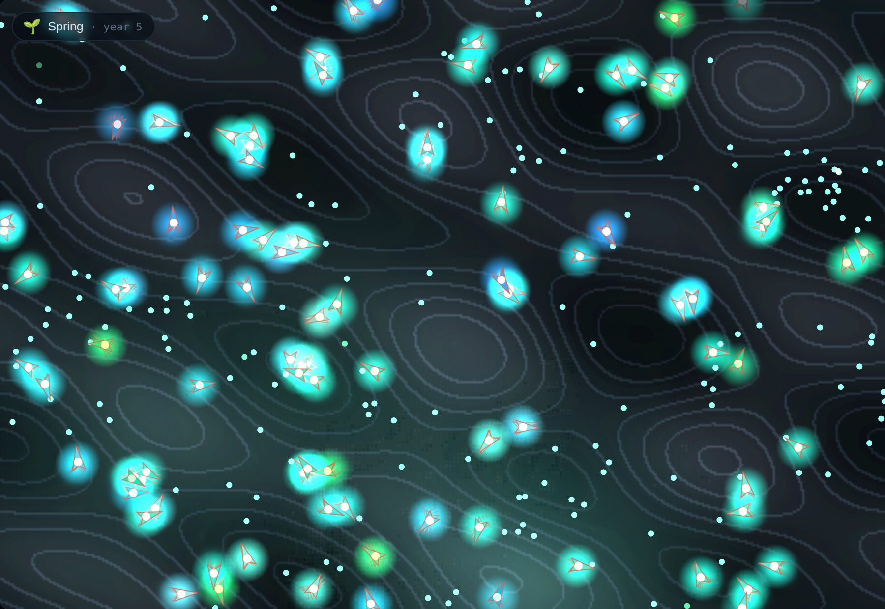
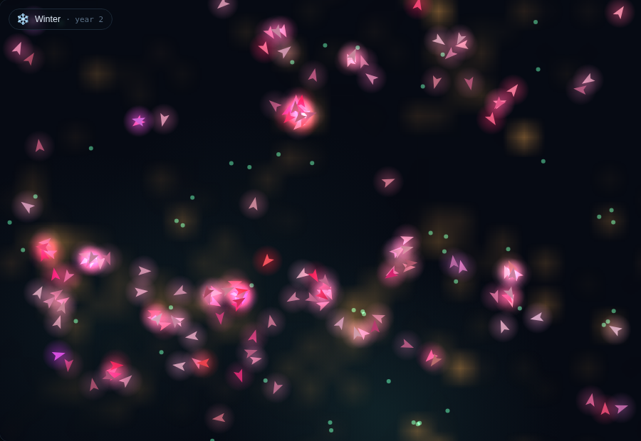
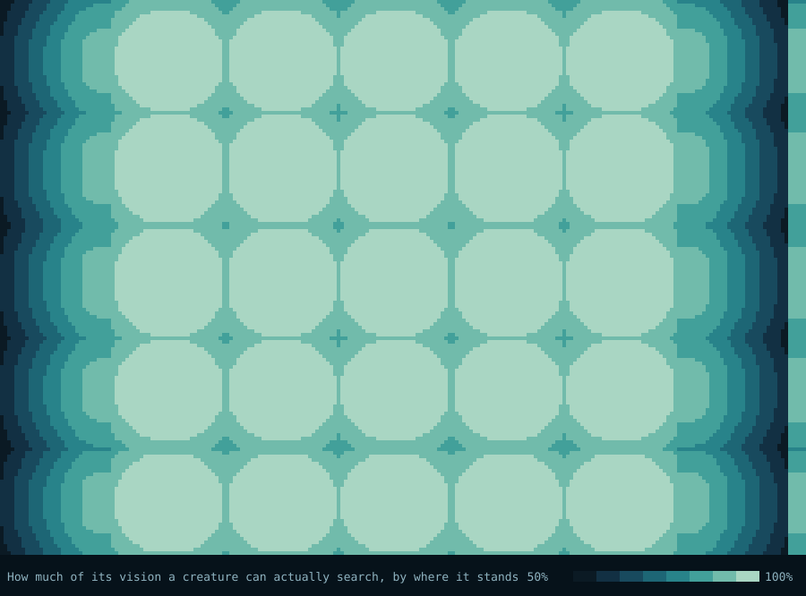

# The science behind Vivarium

Vivarium is a toy, but it isn't a fake. The creatures really do evolve, by a
real evolutionary process, and the behaviours you watch emerge are not scripted
anywhere. This document explains what's actually happening and points to the
ideas and literature it draws on.

## Artificial life

**Artificial life** (often "ALife") is the study of life-like processes through
synthetic systems — software, hardware, biochemistry — rather than by
dissecting existing organisms. Where biology asks "how does *this* life work?",
ALife asks "what is *life-as-it-could-be*?": what are the general principles
that make something adaptive, self-maintaining, evolvable?

Vivarium sits in a long tradition of software worlds where digital organisms
live, compete, and evolve. A few landmarks worth knowing:

- **Conway's Game of Life (1970)** — not evolution, but the founding
  demonstration that fantastically complex, life-like behaviour can emerge from
  a handful of trivial local rules.
- **Tierra (Thomas Ray, 1991)** — self-replicating programs competing for CPU
  time and memory, which spontaneously evolved parasites, immunity, and
  cheaters.
- **Avida (1993– )** — a scientific ALife platform still used in real research
  on the evolution of complexity.
- **PolyWorld (Larry Yaeger, 1994)** — arguably Vivarium's closest ancestor:
  creatures with neural-network brains and vision, living, foraging, fighting,
  and mating in a 2D world, their brains shaped purely by who survives.
- **Framsticks, Evolve 4.0, and a whole genre of browser "evolving creature"
  toys** — the lineage Vivarium most directly belongs to.

Vivarium deliberately picks the smallest slice of that space that still produces
the magic: neural-network brains + energy economy + mutation + selection.

## Evolution without a fitness function

The heart of Vivarium — and the thing most worth understanding — is that
**there is no fitness function.**

In most "genetic algorithm" tutorials you write an explicit scoring function
("reward getting close to the target") and the algorithm optimises it. That is
*directed* evolution: you already know what good looks like and you're just
searching for it.

Vivarium does something closer to what nature does. Nobody scores a creature.
The only thing that happens is:

- a creature that gathers enough energy **reproduces** (its genome, mutated,
  gets another copy in the world);
- a creature that runs out of energy **dies** (its genome stops being copied).

That's it. "Fitness" is not a number the code computes — it is simply the
**realised rate at which a lineage's genes get copied into the future**, which
falls out of the physics of the world. This is *natural* selection rather than
*artificial* selection, and it's why the behaviours feel discovered rather than
designed. No line of code says "move toward food." That behaviour exists because
brains that produce it leave more descendants.

## Neuroevolution

Each creature's brain is a small **artificial neural network**, and the
network's weights are its heritable genome. Evolving neural networks this way —
rather than training them with gradient descent / backpropagation — is called
**neuroevolution**.

Vivarium uses the simplest useful variant: a **fixed topology** (the number of
neurons and connections never changes) with only the weights under selection.
Reproduction copies the weight vector and adds Gaussian noise to some of the
weights. Good weight vectors survive; bad ones don't.

Key properties of this choice:

- **No learning within a lifetime.** A creature's brain never changes while it's
  alive — no backprop, no reward signal, no experience. All adaptation is
  *across* generations. (Adding within-lifetime learning, à la Hebbian
  plasticity, is a tempting future direction — see the devlog.)
- **The genome is directly the phenotype's controller.** There's no complex
  development step between genes and brain; the weights *are* the brain. This
  keeps the causal chain from mutation to behaviour short and legible.

The more famous cousin of this approach is **NEAT** (NeuroEvolution of
Augmenting Topologies, Stanley & Miikkulainen, 2002), which evolves the network
*structure* as well as the weights, growing brains from minimal to complex.
Vivarium ships a trimmed-down NEAT as an optional mode — see the next section.

## Evolving the brain's structure (NEAT)

By default the brain's *shape* is fixed and only its weights evolve. Turn on
evolvable topology and Vivarium instead uses a graph genome in the spirit of
**NEAT**: brains start **minimal** — a few direct sense→motor connections and no
hidden neurons — and *complexify* over generations through two structural
mutations:

- **add connection**: wire together two previously-unconnected neurons;
- **add node**: splice a new neuron into an existing connection (the old link is
  disabled and replaced by two, so behaviour is preserved at first and free to
  diverge after).

The reason this is interesting rather than just "bigger networks" is that
complexity has to **pay for itself**. A new neuron only persists if the creatures
carrying it out-reproduce the ones without it. In Vivarium's world, foraging is a
nearly-linear problem, so a minimal network already does it well — and so, most of
the time, brains *stay* minimal, and only a few lineages evolve hidden structure
where it happens to help. That distribution isn't imposed; it's selection's
verdict on how much brain the problem is worth. It's the same principle behind the
"start minimal, add only what earns its keep" philosophy that makes NEAT famous:
evolution is a stingy engineer.

Two honest simplifications relative to canonical NEAT: Vivarium identifies
connections by their endpoint node ids rather than global *innovation numbers*,
so crossover can't perfectly align hidden neurons that arose independently in
different lineages (the "competing conventions" problem — a non-issue for the
default asexual reproduction, where structure only grows within a lineage); and
it uses a lightweight structural+weight distance rather than NEAT's full
compatibility metric. The essential idea — heritable, selectable, growing
topology — is faithfully present.

## Within-lifetime learning and the Baldwin effect

By default a Vivarium brain is frozen at birth: evolution tunes the weights, but
no individual ever changes. That is *phylogenetic* adaptation — change across
generations. Real nervous systems also do *ontogenetic* adaptation — they change
within a single lifetime, through learning. Vivarium can model that too, via an
optional **neural plasticity** feature.

Each connection carries a second heritable number, a **plasticity coefficient**,
alongside its weight. When plasticity is enabled, a creature's weights update
every tick by a **Hebbian** rule — Donald Hebb's 1949 principle, often summarised
as *"neurons that fire together, wire together"*: a connection strengthens in
proportion to the co-activation of the neurons it joins, gated by its evolved
plasticity coefficient. A decay term continually pulls each weight back toward
the value it was born with, which keeps learning **bounded and reversible** (a
working memory rather than runaway drift) and is the biologically-flavoured
cousin of weight regularisation.

The scientifically interesting part is what happens when you let this *evolve*.
Every genome starts with **zero** plasticity — brains are born fully innate — so
learning is not handed to the creatures; it has to be *discovered*. If a lineage
that can adjust within its lifetime tends to survive and reproduce more, then
mutations that raise plasticity are selected, and the population evolves the
*capacity to learn* from nothing. This is the **Baldwin effect** (James Mark
Baldwin, 1896): learning and evolution interacting, where the ability to learn a
useful behaviour during life can guide and accelerate its genetic assimilation.
Turn plasticity on in Vivarium and you can watch it happen — the plasticity genes
climb from zero and the Learning stat rises off the floor.

Vivarium's plasticity is deliberately the simplest useful form (a single
coefficient per connection, a fixed Hebbian-plus-decay rule). Richer schemes
exist — the full **ABCD / "neuromodulated" plasticity** rules of Soltoggio and
others give each connection several evolvable coefficients and a modulatory
signal — and would be a natural extension.

## The creature's senses

A brain is only as good as its inputs. Each tick a creature perceives (all
normalised to roughly `[-1, 1]`):

| Input | Meaning |
| --- | --- |
| bias | a constant `1`, letting the net learn an offset |
| energy | how full its energy tank is |
| food bearing (sin, cos) | direction to the nearest visible food, *relative to its own heading* |
| food proximity | how close that food is |
| prey bearing (sin, cos) | direction to the nearest creature it *could eat*, relative to heading |
| prey proximity | how close that prey is |
| threat bearing (sin, cos) | direction to the nearest creature that *could eat it*, relative to heading |
| threat proximity | how close that threat is |
| speed | how fast it's currently moving |
| oscillator | `sin` of an internal clock, enabling rhythmic behaviour |
| age | a sense of how far through its lifespan it is |
| own diet | how carnivorous it is (so behaviour can depend on being predator or prey) |
| own size | how big it is |
| heard call | *(signalling only)* the loudest call reaching it, faded by distance |

The last row is the only optional one: with signalling off the sense does not
exist, and the network is arithmetically the one it has always been.

Splitting "nearest creature" into separate **prey** and **threat** channels is
what lets the same brain architecture produce both hunting ("turn toward prey")
and fleeing ("turn away from the threat") — and feeding a creature its *own* diet
and size means a single evolved genome can express a hunter's strategy or a
prey's strategy depending on the body it develops.

Two design details matter a lot here:

1. **Bearings are relative to the creature's own heading**, encoded as
   `(sin, cos)` of the angle. This means a brain can learn "turn toward food"
   as a single rule that works regardless of which compass direction the food is
   in — the representation does the heavy lifting so evolution doesn't have to
   rediscover rotation for every direction. Using `(sin, cos)` instead of the
   raw angle also avoids the discontinuity where the angle wraps from +π to −π.
2. **The internal oscillator** gives brains a source of time-varying input, so
   behaviours like "sweep back and forth while searching" become reachable
   without any memory or recurrence in the network.

## The energy economy

Everything in Vivarium is ultimately about energy, because energy is what
selection acts through:

- **Existing** costs a small amount of energy per tick (scaled by body size and
  a metabolism gene).
- **Moving** costs extra, proportional to thrust — so laziness is cheap and
  sprinting is expensive.
- **Grazing** a food pellet adds energy — but less the more carnivorous you are.
- **Hunting** a bite of a smaller creature adds energy — but more the more
  carnivorous you are, and being carnivorous carries an ongoing metabolic cost.
- **Reproducing** hands half your energy to your child.

This creates genuine trade-offs that selection can explore. A bigger body might
help you hunt but costs more to run. A high-metabolism creature burns energy
faster but... there has to be a compensating advantage for that gene to survive,
and if there isn't, it won't. These trade-offs are what keep the design from
collapsing into a single optimal strategy.

## The books: where the pond's energy actually comes from, and goes

The section above describes the energy economy as a set of rules. From v1.29 the
simulation also *adds it up* — [`src/energy.js`](../src/energy.js) is a ledger of
every unit this world creates and destroys, and the panel reports it live. The
first thing it establishes is uncomfortable, and was true from v1.0:

**This pond is not a closed system, and never was.** A food pellet is a
*position*, not a battery. It holds no energy at all; the `foodEnergy` units
appear at the moment something eats it, sized to the eater's diet. Energy is
minted at ingestion. With scavenging on, a corpse mints again — its meat is
computed from body size, not from what the creature had left. So the ledger is
not a conservation law. It is a record of how much this world creates from
nothing, and what becomes of it afterwards.

What it *does* enforce is an accounting identity:

```
created − destroyed === standing in living bodies and corpses
```

That holds to a relative 1e-9 (floating-point noise, twelve orders of magnitude
below one pellet) at every tick, in a default world, in a world with every
mechanic switched on at once, through a pond that starves out and reseeds
repeatedly, across a save/load round trip, and at the population cap.
`test/energy.test.js` checks all of them. It is a far stronger invariant than
any other statistic here keeps, because it fails on the tick a bug happens
rather than looking slightly wrong later.

### Where it goes

Over 30,000 ticks, default configuration, five seeds:

| seed | metabolism | buried with the dead | leaked | standing | turnover |
|------|-----------:|---------------------:|-------:|---------:|---------:|
| 314    | 96.9% | 3.1% | 0.04% | 20,677 | 547 ticks |
| 7      | 97.0% | 1.9% | 1.09% | 16,699 | 542 ticks |
| 55     | 96.3% | 3.4% | 0.23% | 14,528 | 490 ticks |
| 2024   | 94.1% | 4.1% | 1.79% | 15,535 | 545 ticks |
| 12321  | 98.5% | 1.5% | 0.04% | 27,534 | 715 ticks |

Two things stand out. **Almost everything goes on simply being alive** —
94–98.5% of every unit the pond has ever spent, against 1.5–4.1% carried into
the ground by bodies that still had energy in them. And **the standing stock is
a rounding error**: at seed 314 the pond holds about 20,700 units against
1.15 million minted over the run, and it turns over its entire energy content
roughly every 500 ticks — an eighth of a maximum lifespan. This world does not
store energy. It runs it straight through.

The leak column is the smallest and the most interesting, because it is made of
three different things that the ledger keeps apart: energy lost converting flesh
into a predator (`digested`), meat rotting out of a corpse nobody ate
(`rotted`), and gains discarded because the eater was already full (`spilled`).

### `energyMax` is a clamp that never fires

`spilled` reads **exactly zero** in a default world. Not "negligible" — zero, to
the last bit that differencing an energy against itself can produce.

The reason is a two-line interaction nobody had looked at. `energyMax` is 220
and `reproduceThreshold` is 160, so a creature always splits before it can fill
up, and the ceiling is unreachable. Every world this project has shipped, every
screenshot, every scenario, has carried a clamp that has never once fired.

> **Correction (v1.38).** This section used to be headed "a parameter that does
> nothing" and ended "you could set `energyMax` to 10,000 or delete it and
> nothing would move." The first half is true of the clamp and the second half
> is false of the constant, which the [constant sweep](#is-every-number-in-configjs-a-lever)
> caught by moving it and watching the pond move on tick one. `creature.js`
> feeds the brain `(energy / energyMax) * 2 - 1`: the number is also the
> *divisor of a creature's sense of its own energy*, and `render.js` shades a
> body by the same fraction. Delete it and every brain in the pond reads a
> different world. What that is worth is measured
> [below](#what-the-live-half-of-energymax-is-worth).

Unless reproduction is blocked — which is exactly what `populationMax` does. At
the cap a creature cannot split, its energy climbs to the ceiling, and every
mouthful afterwards is minted and destroyed in the same instant:

| population cap | final population | of all energy made, spilled at the ceiling |
|---------------:|-----------------:|-------------------------------------------:|
| 650 (the default) | 244 | 0.0% |
| 300 | 230 | 0.0% |
| 200 | 200 | 4.3% |
| 120 | 120 | 37.0% |

The cap is documented in `config.js` as "a safety cap so the sim can't explode".
Nothing said that reaching it converts a third of the pond's entire energy budget
into nothing, and that a world at its cap is running a wholly different energy
economy from one below it. Both halves — zero when reproduction is reachable,
dominant when it is not — are pinned in `test/energy.test.js`, because a negative
result that isn't held by a test quietly stops being true.

### What scavenging does to the books

Switching scavenging on adds the second mint. Corpse meat accounts for
8–9% of everything the pond creates — death becomes a *source* of energy
rather than only a sink — and most of it is never eaten: a quarter to four-fifths, depending heavily on the seed and on how carnivorous that pond's lineages got, of all meat
minted rots away, which is why the leak column jumps by an order of magnitude the
moment the feature is on. The nutrient a corpse leaves in the ground (detritus,
v1.27) is deliberately *not* in these books: it is a different currency. Detritus
moves where the crop grows, and a pellet grown on enriched ground mints its own
units like any other. The two recycling loops in this world do not share a unit,
which is worth knowing before reading either as "energy returning to the system".

## Predation and the evolution of a food web

The diet gene (0 = pure herbivore, 1 = pure carnivore) turns the energy economy
into an ecosystem. A carnivorous creature that is meaningfully bigger than a
neighbour can bite it, draining the victim's energy and gaining some in return,
scaled by how carnivorous it is. Because plant nutrition *falls* as carnivory
rises, herbivory and carnivory are genuinely alternative niches rather than one
strictly dominating.

The interesting scientific point is that **predators are never scripted into
existence** — they have to be selected for, and that only happens under the right
ecological conditions. In a food-rich world, herbivory is so easy that the diet
gene is nearly neutral and no predators evolve; carnivores appear only when plant
food is *contested* enough that the untapped biomass of grazers becomes a
worthwhile resource to exploit. This mirrors reality: predation is a response to
competition, not a free lunch.

When predators do evolve, the system exhibits the hallmark of predator–prey
ecology: **oscillation**. Predators boom when prey are plentiful, over-hunt,
crash the prey, then crash themselves, letting prey recover — the
[Lotka–Volterra](https://en.wikipedia.org/wiki/Lotka%E2%80%93Volterra_equations)
cycle, emerging here from individual agents rather than differential equations.
Left unchecked this can drive a world extinct, so Vivarium includes the same
kinds of stabilisers that keep real food webs from collapsing:

- a **handling time** (bite cooldown) capping how fast one predator can kill —
  the discrete analogue of a Holling type II functional response;
- a required **size refuge** (predators must be clearly bigger than prey), so not
  every creature is edible by every other;
- an **intrinsic cost** of carnivory, so predators can't persist where hunting
  doesn't pay; and
- a **grazing fallback**, so a predator whose prey has crashed can limp along on
  plants rather than mass-starving.

Tuned together (see the [devlog](DEVLOG.md) for the full, four-attempt story),
these keep predator/prey dynamics oscillating instead of collapsing.

Optionally, the food web can also close its loop through **scavenging**. Normally
a creature's energy leaves the world when it dies; with scavenging on, its body
becomes a corpse — a pool of meat that carnivores can feed on before it rots.
This models the ecological role of **decomposers and scavengers**, who recycle
dead biomass back into the living system rather than letting it disappear. Its
most visible effect is temporal: a seasonal die-off, which is normally just a
population crash, becomes a pulse of carrion that briefly rewards anything able
to eat the dead — the same way a harsh winter in the wild leaves a spring feast
for scavengers. Vivarium treats scavenging as *opportunistic* (a carnivore homes
in on a nearby corpse exactly as it would on easy prey) rather than a separately
evolved strategy, which is a fair first approximation of how many real carnivores
actually behave.

## Environmental heterogeneity: biomes and seasons

A perfectly uniform, unchanging environment is evolution's least interesting
case: there is one best strategy, everything converges on it, and diversity
collapses. Real environments vary in **space** and **time**, and that variation
is a major engine of biodiversity. Vivarium models both.

**Biomes (spatial heterogeneity).** Food concentrates in fertile patches rather
than spreading evenly, so *where* a creature lives matters. This does two things
of scientific interest. First, it rewards different behaviours in different
places (loiter in a rich patch vs. range widely between poor ones). Second, and
more subtly, it can seed **allopatric speciation** — geographically separated
sub-populations experience slightly different pressures and drift apart, the same
way a mountain range or an island splits a species in the wild. Watch the Tree of
Life while biomes are on and you may catch lineages diverging by region.

Biomes can optionally **drift**, each roaming in a different direction. A moving
habitat is a standing source of directional selection: the environment a lineage
adapted to is always sliding out from under it, so foraging strategies that track
the food (rather than parking in one spot) are continually favoured. Shifting
habitats are, in the real world, a major driver of both migration and speciation —
a static optimum lets a population converge and stop; a moving one keeps evolution
in motion.

**Seasons (temporal heterogeneity).** Food supply rises and falls on a yearly
cycle, so *when* a creature lives matters. Seasonality selects for strategies
that a constant climate never would: riding out lean winters, exploiting summer
booms, timing reproduction. It also drives **population cycles** — the pond
blooms and crashes with the year — and those recurring bottlenecks are
evolutionarily potent, because a bottleneck is a moment of intense selection and
a loss of genetic diversity (a founder effect in miniature) every single winter.

Combine seasons with predation and you get the full drama: a hard winter can
crash the prey, which crashes the predators, which lets the survivors rebuild —
boom-and-bust ecology playing out from individual agents, not equations. (Tuning
this so it stays dramatic without simply dying out is a story in the
[devlog](DEVLOG.md).)

## Contagion: epidemics, acquired immunity, and the cost of crowding

Predation is not the only way one creature's existence can be bad for another's.
Vivarium's optional **contagion** adds a pathogen with no genome, no brain, and no
interest in anything but proximity: a susceptible creature within
`infectionRadius` of an infected one catches the illness with a fixed per-tick
probability, stays sick for `diseaseDuration` ticks while paying an extra
metabolic cost (a fever is expensive), and then — if it survives — is **immune for
the rest of its life**.

That is a textbook **SIR model** (susceptible → infected → recovered), with two
differences that matter. First, it is *individual-based and spatial*: there is no
well-mixed population and no differential equation, only creatures that happen to
be near each other, so the epidemic spreads as a front through whatever crowd the
food has assembled. Second, and more interesting, **immunity is acquired but never
inherited.** Every newborn is susceptible again. Births therefore continuously
replenish the susceptible pool, which is exactly the condition under which a real
epidemic stops being a single burn-through event and becomes **recurring waves** —
the mechanism behind the historical periodicity of childhood diseases like measles.
Watch the *Sick* and *Immune* stats in a plague world and you can see the cycle:
cases climb, the pond passes herd immunity, the pathogen runs out of hosts and
vanishes, susceptibles accumulate with each generation, and the next arrival
ignites another wave.

The evolutionary consequence is a **density-dependent cost**. Every other pressure
in Vivarium pushes creatures *together*: food concentrates in biomes, so the best
place to be is where everyone else already is. A contact-transmitted pathogen is
the first pressure that punishes exactly that — it makes the crowd itself
dangerous, and it is the same trade-off that shapes real herding, colonial nesting,
and schooling behaviour. Contagion is deliberately *not* given an evolvable
resistance gene, because the interesting question is whether a lineage's
**behaviour** — how tightly it packs, how far it ranges — shifts under a pressure
that only tight packing creates.

## Regrowth: a renewable resource, and the tragedy of the commons

For seventeen versions the food in Vivarium was not a population — it was a
supply. Pellets appeared out of nowhere at a fixed rate, so grazing had no lasting
consequence: a biome stripped to nothing refilled exactly as fast as one nobody
had touched. That is a *donor-controlled* resource, and it quietly rules out an
entire class of ecology.

The optional **regrowth** rule makes the crop reproduce like everything else in
the pond. Two things follow from that one idea:

- **Growth is density-dependent.** New pellets can only come from standing ones,
  so the spawn rate scales with how much crop is left (down to a floor that keeps
  a stripped world recoverable rather than dead). This is the logistic-growth term
  of a **consumer–resource model** — the same `rN(1 − N/K)` that underlies
  Lotka–Volterra — arrived at from the agent's side rather than written down as an
  equation.
- **Growth is local.** Most seeds land within `regrowthRadius` of their parent and
  take with a probability equal to the local fertility, so plants recolonise from
  the edges of what survived. Wipe an area completely and it stays bare until
  something spreads back into it — spatial **recruitment limitation**, which is why
  real overgrazed ground recovers from its margins inward.

What you see is the classic **boom-and-bust cycle**, and it is genuinely new to
this world: the standing crop climbs to the cap, a herd builds on the surplus,
the herd eats faster than the plants can breed, crop and grazers crash in that
order, and the survivors wait out a slow green recovery. Population and food
oscillate *out of phase* — a peak in one sitting in the trough of the other —
which is the signature of consumer–resource coupling rather than of weather.
Seasons already gave the pond an externally-imposed rhythm; regrowth gives it an
**endogenous** one, generated by the creatures themselves.

It also puts the pond's first genuine **commons** on the table. Any individual is
better off eating the pellet in front of it, and a population that all do so can
destroy the resource that feeds them — the classic tragedy. Vivarium offers no
mechanism for restraint (a creature cannot see the standing crop, only the nearest
pellet), so the answer, if there is one, has to be behavioural and spatial: ranging
further, dispersing rather than herding, or simply dying back to a level the crop
can sustain. Watching *which* of those the pond finds is the point.

## Signalling: a channel that nobody could hear

From v1.0 to v1.19 every creature's brain had three motor outputs: turn, thrust,
and a third that the code called a "colour signal". It shifted the body's
saturation on screen by a few percent and did nothing else. No creature could
perceive it. That is a strange object to leave in an evolutionary model, because
selection cannot act on a trait that has no consequence: the third output was
free to wander wherever mutation took it, and it did, drifting into saturation
because a `tanh` of a random-walking sum is almost always near ±1. Nineteen
versions of creatures were flashing at each other in a world with no eyes for it.

**Signalling** (opt-in) gives the channel receivers. A creature now senses the
loudest call reaching it — the strongest `|signal|` among neighbours within
`signalRadius`, faded linearly with distance — through a small block of **ear
genes**, one weight per hidden neuron, that mutate and cross over like any other
part of the brain. Three details are deliberate:

- **A one-tick delay.** Creatures are updated in sequence, so reading a
  neighbour's *live* signal would mean the first creature in the array hears
  yesterday and the last hears today. Each creature therefore broadcasts the
  signal it emitted on the previous tick, frozen before anything moves. What you
  hear cannot depend on the update order.
- **Calling costs energy**, `signalCost` per tick per unit of loudness. A free
  signal is unphysical, and in signalling theory cost is what keeps a signal
  honest — a call that anyone can make for nothing can be made by a liar too.
- **Earshot ignores the dark.** Vision shrinks toward `nightVisionFactor` when
  the day/night cycle is on; hearing does not. A voice carries at midnight, which
  is exactly when a creature that cannot see would most want one.

### What actually happened: two negative results

Neither of the things this mechanic was built to produce showed up in the sweeps,
and both are worth recording.

**Volume does not evolve.** The cost was meant to select for silence, so that any
noise that survived would be noise worth making. It doesn't: sweeping
`signalCost` from 0 to 0.25 — five times base metabolism, enough to visibly
depress the population — moved mean loudness only from about 0.85 to about 0.72
across seeds. The reason is the `tanh`. Reaching *quiet* means holding the third
output's pre-activation near zero across every sensory state a creature meets,
which is a vanishingly thin region of weight space; mutation cannot find it and
selection is not strong enough to drag anything there. Cost turns out to be a
lever on *who survives*, not on *how loud they are*.

**A promising signal-meaning statistic turned out to be an artifact.** The
natural question about a signal is not how loud it is but whether it is *about*
anything, so the obvious measurement is the gap between what creatures say while
something that could eat them is in sight and what they say when it isn't. That
gap is real and often large — in one 12,000-tick run it settled at 0.31 and held
the same sign for 74% of the second half of the run, which looks a great deal
like an alarm call.

It is not one. The control is to measure the same gap in worlds where
**signalling is switched off** — where the signal still exists and still depends
on the threat sense, but no creature can hear it and no ear gene is ever drawn.
The gap is just as big:

| hearing | mean \|gap\| across predator-bearing worlds |
| --- | --- |
| on | 0.17 |
| off | 0.35 |

The strongest "alarm call" in the whole experiment (0.58, sign-stable in 88% of
samples) came from a world where nobody could hear anything at all. The
explanation is mundane: a pond usually ends up dominated by a few related
lineages, and if their shared brain happens to couple the threat inputs to the
third output — which costs nothing, so nothing stops it — then the whole
population "says" the same thing in danger, having inherited it rather than
agreed it. A population-level correlation measures common ancestry at least as
readily as it measures communication.

You can reproduce the control in a few lines:

```js
import { World } from "./src/world.js";
import { makeConfig } from "./src/config.js";
import { INPUT_THREAT_PROX } from "./src/creature.js";

const gap = (w) => {
  let d = 0, nd = 0, e = 0, ne = 0;
  for (const c of w.creatures) {
    if (c._in[INPUT_THREAT_PROX] > 0) { d += c.signal; nd++; } else { e += c.signal; ne++; }
  }
  return nd >= 5 && ne > 0 ? d / nd - e / ne : null;
};

for (const signalling of [true, false]) {
  const w = new World(makeConfig({ seed: 888, signalling, predation: true }));
  const late = [];
  for (let t = 1; t <= 12000; t++) {
    w.step();
    if (t > 7200) { const g = gap(w); if (g !== null) late.push(g); }
  }
  const m = late.reduce((a, b) => a + b, 0) / late.length;
  console.log(signalling ? "hearing on " : "hearing off", m.toFixed(3));
}
```

So what the app reports is the honest quantity: **Heard**, the mean strength of
the call actually reaching a creature. It is exactly zero where nobody can hear,
and it moves with the ecology rather than with wishful thinking — it swells as
survivors pack into fertile ground and collapses with the population in a crash.

What is genuinely true is narrower, and still worth having: a channel exists
where none did, an action can now depend on what a neighbour is doing several
body-lengths away, and there is a heritable, evolvable, costed pathway from one
creature's state to another's behaviour. Whether 12,000 ticks of a 40-creature
founding population is anywhere near enough for a convention to *emerge* on that
pathway is an open question, and the honest answer from these sweeps is: not yet,
and not detectably. Communication is thought to be hard to evolve for exactly the
reason the model makes vivid — a signal is only worth making if others respond,
and responding is only worth doing if the signal is informative, so each half of
the arrangement is useless until the other exists.

## What the pond dies of

Vivarium has counted its dead since v1.0 and never once recorded what of. That
makes the single most dramatic thing the model produces — a population halving —
unreadable, because a crash caused by a hard winter and a crash caused by a
predator boom look identical from the outside. Both are a line going down.

Every death now names its cause at the moment it is decided, so nothing has to be
inferred afterwards from a body at zero energy:

- **starvation** — energy reached zero, whether spent on metabolism, movement,
  the upkeep of carnivory, a fever, or a call;
- **age** — the creature reached `maxAge` with energy to spare;
- **predation** — a bite emptied it, recorded by the predator that landed it.

The three are exhaustive and exclusive: the causes always sum to the death count,
and the predation tally is checked against the entirely separate kill counter the
world has kept since v1.1. The app shows the mix over the last 120 deaths rather
than the whole run, because a cumulative share stops moving after a few thousand
ticks and the interesting thing about mortality is that it *changes*.

### Hunger does nearly all the editing

Eight seeds, 12,000 ticks each, default configuration:

| world | starvation | old age | predation | mean lifespan | mean population |
| --- | --- | --- | --- | --- | --- |
| default | 78% | 11% | 11% | 2013 | 197 |
| predation off | 84% | 16% | **0%** | 2247 | 227 |
| contagion on | 78% | 12% | 10% | 1929 | 192 |
| scavenging on | 76% | 13% | 11% | 1995 | 200 |
| regrowth on | 90% | 1% | 9% | 1212 | 79 |

The headline mechanic of this world — the predator/prey arms race that the
default seed was chosen to display, that the README opens with and that most of
the rendering code exists to draw — accounts for about a **tenth** of the deaths
in it. It is wildly seed-dependent (2% to 40% across the eight), and it is never
the main event. Selection here is done overwhelmingly by hunger. That is worth
knowing before reading any claim about what evolved and why: the visible drama
and the actual selection pressure are not the same thing.

The control is the row with predation off, where the predation share reads
**exactly** 0.000 on all eight seeds — not a small number, zero. A cause that
cannot happen must report none, or the readout is measuring something other than
what it says. (This is the same discipline the v1.20 signalling statistics had to
pass, and for the same reason.)

### Old age is the sensitive indicator

The smallest slice moves the most. Dying of old age means the world let you
finish: you found enough food, for long enough, to run out of time rather than
energy. Removing predators raises it from 11% to 16% and adds ~230 ticks to the
mean life. Switching on **regrowth**, where the crop is a population that a herd
can strip, all but abolishes it — 11% to 1.4% — while cutting mean lifespan by
40% and the standing population by 60%. Regrowth is the harshest thing in the
config file, and the death mix says so much more clearly than the population
chart does.

### Contagion hides inside starvation, and that is honest

Switching on the disease barely touches the mix (78.1% starvation against 77.9%
without it) and costs about 4% of mean lifespan. This is not the accounting
failing; it is the accounting being literal. The pathogen has no lethal step —
it drains `diseaseMetabolicCost` extra energy per tick, and what actually kills
its host is running out. "Died of disease" would be an interpretation, and a
tempting one, so the readout doesn't offer it. The place to read the epidemic is
the Sick/Immune counters and the chronicle, and the honest summary of its
mortality effect is that a fever here kills by starving you slightly sooner.

Reproduce any row with a dozen lines:

```js
import { World } from "./src/world.js";
import { makeConfig } from "./src/config.js";
const w = new World(makeConfig({ seed: 314 }));       // add { predation: false } etc.
for (let i = 0; i < 12000; i++) w.step();
const b = w.stats.deathsBy;
const total = b.starvation + b.age + b.predation;
console.log(b, "of", total, "deaths");
console.log("mean lifespan", (w.stats.lifespanSum / w.stats.deaths).toFixed(0));
```

### Putting the causes on the clock, without losing any of them

The 120-death window is the right thing to *watch* and the wrong thing to
*remember*. By the time a crash has scrolled far enough back to be a visible
shape on the population chart, the window that could have explained it has
turned over several times. Since v1.26 each history sample carries the death
toll alongside the population and the food, so the mix is on the chart's own
axis: a strip under the chart, stacked by cause, on whichever scope the chart
is showing.

The interesting part is which number gets stored. The archive behind the
whole-run view keeps a fixed number of rows and halves its resolution every time
it fills, and v1.22 established what that costs: a thinned series loses exactly
the peaks and troughs a chart exists to show, which is why every retained point
carries an exact min/max envelope of the samples it absorbed.

None of that machinery is needed here, because the counters are **cumulative**
rather than per-interval. A running total is monotone, and any two samples —
however many were discarded between them — partition the ticks between them with
no gap and no overlap, so their difference is the exact number of deaths in that
stretch. The chart's time resolution degrades; its arithmetic does not, at any
capacity, for any length of run. It is worth stating the general form, because
the temptation runs the other way: *an extensive quantity recorded cumulatively
is lossless under decimation, in a way an instantaneous one can never be.*

Storing deaths-per-interval instead would have looked identical on a fresh run
and silently under-reported from the first halving onward, so
`test/mortalityHistory.test.js` asserts both halves — that the cumulative form
gives the same totals through archives of capacity 4 and 512, and that the naive
form loses more than 80% of the deaths at capacity 4. Seeing it is four lines:

```js
import { World } from "./src/world.js";
import { makeConfig } from "./src/config.js";
import { mortalitySeries } from "./src/stats.js";
const w = new World(makeConfig({ seed: 42 }));
for (let i = 0; i < 20000; i++) w.step();
const s = mortalitySeries(w.stats.runHistory.series());
// The archive has halved several times by now; this still equals the ledger.
console.log(s.total, "deaths in", s.intervals.length, "intervals");
console.log(w.stats.deathsBy);
```

Both CSV scopes carry the same three columns, cumulative for the same reason:
subtract one row from the next and you have the exact toll between them, whatever
the thinning did to the rows around them.


## Terrain: why a cost is not a landscape

Until v1.23 space was this world's last unconditional gift. Food had biomes and
time had seasons, but the *ground* was uniform: being anywhere cost exactly what
being anywhere else cost. Terrain (opt-in) replaces that with a static,
seed-derived roughness field on the torus. Nothing is blocked, and — importantly
for what follows — nothing can perceive it. There is no terrain sense, no new
brain input, no gene for preferring flat ground.



The design had two halves, and only one of them works. That is the interesting
part.

### The half that failed

The first version made rough ground **expensive**: roughness multiplies the
movement half of the metabolic bill, up to 2.6x on the worst ridges. The
reasoning was straightforward selection. A creature that spends its life
crossing ridges burns more energy for the same travel, so it reproduces less and
dies sooner; lineages that happen to live in the basins should therefore come to
dominate, and the population should gather in the flats without a single
creature ever knowing why.

The measurement is the **ground bias**: the mean roughness under the living,
minus the mean roughness of the whole landscape. It is negative when the pond
sits on flatter-than-average ground, and — the property that makes it worth
trusting — it is exactly zero when terrain is off, because there is no field to
measure against. A statistic that is non-zero with its mechanism disabled is not
measuring the mechanism.

Ground bias for a pure movement tax, at the full 2.6x cost, is **-0.003**. That
is nothing. Six seeds run for 12,000 ticks scatter either side of zero, and the
control — the same worlds with terrain off, scored against the landscape they
*would* have had — sits at -0.005, which is to say the two are
indistinguishable.

The diagnosis is a timescale mismatch, and it is not subtle once you look for it.
A creature moves at up to 2.6 px/tick in a world 900 px across, so it crosses the
map in roughly 350 ticks. It lives for up to 4,200. Every creature therefore
samples the entire landscape a dozen times over within a single lifetime, and a
lineage samples it thousands of times. **Mixing is more than an order of
magnitude faster than selection**, so a spatially varying death rate averages
clean away before it can leave any spatial structure behind. The energy is really
being spent — creatures on ridges really do burn more — but it is spent by
*everyone, everywhere*, which makes it a tax on the population rather than a
feature of the map.

### The half that works

The fix is to make the ground affect something that does not average away: where
the food is. Ridges are now **barren** as well as expensive — a new pellet is
less likely to take the rougher the ground it lands on, up to
`terrainBarrenness`. Total food influx is unchanged (a pellet that is refused
looks again, up to four times, and is then placed regardless), so this moves the
crop rather than shrinking it, exactly the contract the biomes have kept since
v1.3.

Sweeping both knobs over four seeds at 9,000 ticks:

| movement cost | barrenness | ground bias | mean population |
| --- | --- | --- | --- |
| 2.6x | 0 | -0.003 | 171 |
| 2.6x | 0.5 | -0.011 | 248 |
| 2.6x | **0.85** | **-0.057** | **209** |
| 2.6x | 1.0 | -0.060 | 213 |
| 1.6x | 0.85 | -0.029 | 239 |
| 2.0x | 0.85 | -0.036 | 243 |
| 3.4x | 0.85 | -0.053 | 191 |
| 4.0x | 0.85 | -0.059 | 174 |

Read down the first four rows: at a fixed movement cost, the entire settling
effect is bought by barrenness. Read the rest and the movement cost does matter —
but as a *modulator*, roughly doubling the effect from 1.6x to 2.6x, on top of a
mechanism that only exists because the food moved. On its own it does nothing at
any level tested.

With the shipped defaults, six seeds at 12,000 ticks give a ground bias of
**-0.046**, against **-0.005** for the terrain-off control on the same seeds.
Every seed is negative. One caveat worth stating: on seed 314 the control itself
reads -0.034, because that seed's fertile biomes happen to sit in ground the
terrain field also calls flat. The two fields are drawn independently — biomes
come from the world RNG before terrain exists, terrain from an integer hash of
the seed — so this is coincidence rather than construction, but it is a reminder
that a single seed is not an experiment.

### Reproducing it

```js
import { World } from "./src/world.js";
import { makeConfig } from "./src/config.js";
import { groundBias } from "./src/terrain.js";

for (const barrenness of [0, 0.85]) {
  let sum = 0;
  for (const seed of [314, 7, 21, 99]) {
    const w = new World(makeConfig({ seed, terrain: true, terrainBarrenness: barrenness }));
    for (let i = 0; i < 9000; i++) w.step();
    sum += groundBias(w.terrain, w.creatures);
  }
  console.log(barrenness, (sum / 4).toFixed(4));
}
// 0    ~ -0.003   a movement tax alone: the pond does not move
// 0.85 ~ -0.057   barren ridges: the pond settles into its basins
```

Both rows pay the identical movement cost. The only difference is whether the
ground also refuses to grow anything, and that difference is the whole effect.
The comparison is pinned as a test (`test/terrain.test.js`) so it cannot quietly
stop being true.

### A seed where the control reads nothing at all

The caveat above — that seed 314's terrain-off arm already reads -0.034, because
its biomes happen to sit where the roughness field is flat — is the reason a
single seed cannot carry this claim. It also raises an obvious question: is there
a seed where the coincidence is *absent*, so that the whole of the settling is
the mechanic's doing?

A 48-seed sweep (terrain and detritus on, 9,000 ticks, scored on relief,
settling and a pond that survives) says yes, and picked the world that ships as
the **Lay of the Land** scenario. On seed 13, over 20,000 ticks:

| arm | ground bias | crop bias | mean population |
| --- | --- | --- | --- |
| shipped (2.6x cost, 0.85 barrenness) | **-0.111** | -0.048 | 131 |
| movement tax only (barrenness 0) | **-0.003** | +0.019 | 158 |

The tax-only arm is the same number the four-seed sweep produced, and here it is
not competing with any accidental alignment: this world settles because the
ridges grow nothing, full stop. It is the cleanest single-seed demonstration of
the result in the repository, which is why the scenario ships on it rather than
on a prettier world with a muddier control.

The sweep turned up one thing worth recording beyond the choice. A seed fixes
the landscape — the field is an integer hash of it, drawn before the world
exists — and across the 48, the landscape's **relief** (the standard deviation of
roughness, 0.214 median) correlates with settling at **r = -0.50**. A more
contoured world settles its pond harder, which is what the mechanic predicts and
is not something the seed choice was scored to produce. Relief does not predict
where the *crop* ends up (r = 0.05): that is set by how a particular landscape
lands against a particular set of biomes, and there the coincidence really is a
coincidence.

### What this is and isn't

The pond ending up in its basins is **not** the creatures learning to avoid
rough ground. They cannot perceive it, and the "half that failed" above is the
evidence: when the ground was the only thing that differed, they were completely
indifferent to it. What terrain does is move the resource, and the population
follows the resource the same way it always followed the biomes. The honest
one-line summary is that terrain is a second, independently placed fertility
field with an energy cost attached — and the energy cost, on its own, buys
almost nothing.

Which is a result worth having. It says something fairly general about this
class of model: **in a well-mixed world, a spatial cost does not produce spatial
structure.** To get structure you need either perception (so behaviour can
respond within a lifetime), or restricted movement (so lineages stay put long
enough for local selection to bite), or a spatially varying *resource* — and the
third is by far the cheapest to add.

## The ground sense: perception is not a pressure

The section above ends with a list of three ways to get spatial structure out of
a well-mixed world — perception, restricted movement, or a spatially varying
resource — and a note that the third is the cheapest. v1.23 shipped the third.
v1.33 went back and built the first, because "they cannot perceive it" had been
sitting in this document for ten versions as the obvious unfinished business.

The **ground sense** (opt-in, `groundSense`) gives every creature one more
scalar: the roughness of the ground it is standing on, 0 on the flattest and 1
on the roughest the config prices. Like the ear, it has its own gene block
outside the brain's weight vector, so switching it on costs zero random draws in
any world that leaves it off.

It is deliberately a *local* sense. A creature is told what is under it, never
which direction is smoother. That is not a limitation to apologise for — it is
the information a bacterium has, and run-and-tumble chemotaxis (move on while
conditions are bad, linger once they are good) concentrates a population in the
good places with nothing more. Whether evolution here finds that was the
experiment.

It does not.

### The wire is real

First, the sanity check: does the input reach the motor commands at all? For
each living creature, hold every other sense at what it actually perceived this
tick and swing the foot from 0 to 1; the mean absolute change in turn and thrust
is how much of its steering the ground decides. On the motor scale of (-1, 1):

| | founders | after 9,000 ticks |
|---|---|---|
| ground sense on | 0.257 ± 0.039 | 0.367 ± 0.109 |
| ground sense off | **0.000** | **0.000** |

Founders are born with a random foot, so 0.257 is what an unselected wire is
worth: the ground is already deciding about an eighth of the full range of both
motor commands. And the off arm is an exact zero, not a small number — the
property that makes the statistic worth quoting at all.

### But selection is indifferent to it

The climb from 0.257 to 0.367 is exactly what selection wiring up a useful sense
looks like. It is also exactly what a random walk looks like: foot genes mutate
at the same rate as everything else, and |w| grows under a random walk whether
or not anything is grading it.

So — the v1.27 rule, that a feature touching what a creature perceives needs a
*scrambled* arm and not only a disabled one — a third arm was run in which each
creature is handed the roughness of a **different, random patch of the same
landscape** every tick. Identical distribution of values, zero information about
where it actually is.

| after 9,000 ticks | sensitivity |
|---|---|
| true foot | 0.367 ± 0.109 |
| scrambled foot | 0.383 ± 0.156 |

The scrambled arm ends up marginally *higher*. The growth is drift. Nothing in
this pond is selecting on the ground sense.

### And the pond does not settle

The behavioural question, measured with the same **ground bias** as v1.23 (mean
roughness under the living, minus the mean roughness of the landscape; exactly 0
without terrain). To isolate behaviour, `terrainBarrenness` is set to 0, so the
crop does not care about the ground and any settling has to be something the
creatures did. Twelve seeds, 9,000 ticks, mean over the last 3,000:

| roughest ground costs | bias, sense off | bias, sense on | paired difference | seeds in the predicted direction |
|---|---|---|---|---|
| 2.6× (the shipped cost) | -0.0074 | -0.0032 | **+0.0042 ± 0.0164** | 2 / 12 |
| 6× | -0.0162 | -0.0218 | -0.0056 ± 0.0116 | 9 / 12 |
| 12× | -0.0153 | -0.0350 | -0.0197 ± 0.0413 | 8 / 12 |

At the cost this world actually ships, the sign is *wrong* and two seeds out of
twelve go the predicted way — which is a coin. Turn the cost up and the sign
flips to the predicted direction and stays there in eight or nine seeds out of
twelve, but the spread between seeds is two to three times the effect, and by
12× the pond is a different world anyway (37 creatures against 60, the arms
having fallen into different regimes — the v1.32 warning about seed-matched
pairs applies at full strength). The honest reading of the bottom two rows is
*a hint, in the direction the design predicted, that does not clear the noise*.

### Why: a sense is only worth what the thing it senses costs

The diagnosis was in this document before the experiment was run, one section
up, and I read past it for ten versions.

v1.23 measured the movement tax on its own at a ground bias of -0.003 — nothing
— and concluded a spatial cost cannot produce spatial structure in a well-mixed
world. I then wrote down perception as one of the three remedies, and I have
been reading that list ever since as a to-do with perception at the top. But the
same paragraph had already established that **rough ground barely costs
anything**: at 2.6× it prices only the movement half of the bill, of a creature
that thrusts intermittently, on ground it crosses in a few hundred ticks. There
was never a fitness gradient for the foot to climb.

Perception does not create a pressure. It can only exploit one. Giving a
creature a sense for a variable that hardly affects its survival buys exactly
what the theory says it should: a wire that carries a real signal into behaviour,
that behaves indistinguishably from a wire carrying noise, and a population that
sits where it always sat. The remedies on that list are not interchangeable, and
the two I have not tried — restricted movement, and a resource that varies in
space — are the two that change the *timescale* rather than the information.

That is also the shape of the standing lesson here: a proposed fix has to
address the diagnosis you already wrote down. Mine addressed a different one.

### Reproducing it

```js
import { World } from "./src/world.js";
import { makeConfig } from "./src/config.js";
import { groundBias } from "./src/terrain.js";

for (const groundSense of [false, true]) {
  let sum = 0;
  const seeds = [1, 2, 3, 5, 7, 8, 9, 11, 13, 17, 19, 23];
  for (const seed of seeds) {
    // barrenness 0 leaves the movement cost as the only thing terrain does,
    // so the crop cannot do the settling on the creatures' behalf.
    const w = new World(makeConfig({ seed, terrain: true, terrainBarrenness: 0, groundSense }));
    for (let i = 0; i < 9000; i++) w.step();
    sum += groundBias(w.terrain, w.creatures);
  }
  console.log(groundSense, (sum / seeds.length).toFixed(4));
}
// false ~ -0.007
// true  ~ -0.003   the sense does not move the pond
```

The sensitivity measurement is `groundSway()` in `src/creature.js` — the same
quantity the inspector shows for the selected creature, so a reader can watch
the number this section is about. `test/groundSense.test.js` pins the parts that
must not drift: the sense reads exactly 0 without terrain, adds exactly nothing
to a brain on flat ground, and costs no random draws while it is off.

The null itself is **not** pinned by the suite, and that is a deliberate choice
rather than an oversight. A single world's ground bias at 2,500 ticks ranges
from +0.065 to -0.041 across five seeds in either arm — a pond of five survivors
produces a number as confidently as a pond of two hundred. Any assertion cheap
enough to run in the suite would be measuring the noise, and a flaky test that
fails on an unlucky seed teaches a future reader that the result is fragile when
it is the *test* that is. Twelve seeds and 9,000 ticks is the smallest honest
version, and it lives in the script above.

### What shipped, and why it shipped at all

A null result, kept rather than deleted, on the same terms as v1.23's failed
half: the pair of arms is the experiment, and a mechanism that is present,
correct and demonstrably unselected says something a missing mechanism does not.
The sense is off by default and does nothing to any existing world. What it
leaves behind is a working perception channel for the next person — including
the next me — who wants to test it against a cost worth avoiding.

## Detritus: a pond that feeds on its own dead

Food has arrived in this world from nowhere since v1.0. v1.18 made the crop
conditional on itself (pellets seed from pellets) and v1.23 made it conditional
on the ground (ridges are barren), but nobody had questioned the *source*:
pellets appear at a rate, and a creature's death had no consequence at all for
the place it happened in. Death was the one event in this pond that the pond did
not notice.

Detritus (opt-in) closes that loop. A body leaves nutrient in the cell it died
in; the nutrient rots with a half-life of about 230 ticks; and a share of the
pellets that used to appear from nowhere instead sprout out of enriched ground,
drawing it down as they go. Nothing is created — total food influx is exactly
what it always was, because a seed the ground cannot feed simply appears the old
way. Only the *placement* changes.



### The accounting

A body is worth `radius x 0.8` units of nutrient and a sprouting pellet costs
one, so a typical creature funds about four pellets and the largest possible one
about six. A cell holds eight — enough that a whole carcass is never truncated,
not enough to bank three.

Those constants put a ceiling on the mechanism, and the ceiling is the first
interesting number here. Six seeds at 9,000 ticks with the shipped defaults:

| | share of new food grown from the dead |
| --- | --- |
| detritus off | **0%** — exactly, on every seed, to every decimal place |
| detritus on | **24%** |

The pond's own dead can pay for roughly a quarter of its crop. That is less a
tuning choice than a consequence of arithmetic already in `config.js`: at ~0.1
deaths per tick and four pellets a body, the dead supply about 0.4 pellets a tick
against a food rate of 1.8. Raising `detritusPerRadius` does not help — the cell
cap throws the surplus away, which it must, or one bad winter in one biome would
own the crop for thousands of ticks afterwards. (Setting the cap to 4 instead of 8
silently truncated a third of every large carcass and cost seven points of that
share, which is how the constant got measured rather than guessed. Halving
`detritusUptake` would reach 46%, at the price of a body funding more pellets than
it plausibly ate.)

The other number worth reporting is how *localised* the ground's memory is: about
**93% of the nutrient sits in a tenth of the cells** at any moment, with a third
of cells holding anything at all. It is a genuinely patchy map, not a uniform
enrichment, which is what makes it worth drawing.

### The control: it is not the dead that move the population

A detritus pond holds more creatures than a control pond. Eight seeds at 9,000
ticks give **+8.2% ± 5.3 (sem)** — marginal on its own, and the obvious story
writes itself: the crop now grows where the creatures are, so they spend less of
their lives travelling to it.

The obvious story is wrong, and two measurements say so.

The first is direct. If food were being delivered closer to its consumers, the
mean distance from a creature to the nearest pellet would fall. It **rises**, from
42.9px to 47.4px.

The second is the control this project has learned to build before the narration.
Detritus does two things at once: it makes a share of the crop follow the dead,
*and* it takes that same share out of the biome-weighted spawn, where food had
been concentrated into four fertile patches since v1.3. So run a third arm with
the mechanism half-disabled — the same pellets sprout, the same nutrient is drawn
down, but the cell is picked **uniformly at random** instead of by nutrient:

| arm | mean population | vs control |
| --- | --- | --- |
| detritus off | 196.3 | — |
| detritus on | 211.3 | +8.2% ± 5.3 |
| shuffled placement | 207.3 | +7.6% ± 11.5 |
| | | *real vs shuffled:* **+6.1% ± 8.3** |

Scrambling the placement does not throw the effect away. The two arms are not
distinguishable from each other, and neither is cleanly distinguishable from the
control. Whatever moves the population, it is not that the food follows the dead;
it is that a quarter of the crop stopped being crowded into the biomes.

Population variability is untouched as well — cv 0.220 with detritus against 0.229
without — so the delayed feedback loop the mechanic builds (death feeds food feeds
life feeds death) does **not** make the pond swing more, which is exactly what it
was designed to do.

So the honest summary is narrower than the design: **detritus is a real,
measurable mechanism with no demonstrated population consequence.** A quarter of
the crop grows where things died, none of it does with the feature off, the map of
it is patchy and legible — and the pond is no more or less stable for it than a
pond whose food was simply scattered more evenly.

There is a general rule in that, and it is not the one this page already had. The
old rule was *a statistic that is non-zero with the mechanism off is not measuring
the mechanism* (see [Signalling](#signalling-a-channel-that-nobody-could-hear)),
and it does not catch this: the share really is 24% on and 0% off. The sharper
form is that **when a feature changes *where* something goes, the control is not
"off" — it is "somewhere else at random".** Comparing against off measures your
change plus the hole it left.

### Reproducing it

```js
import { World } from "./src/world.js";
import { makeConfig } from "./src/config.js";

for (const detritus of [false, true]) {
  for (const seed of [314, 7, 42, 1009]) {
    const w = new World(makeConfig({ seed, detritus }));
    for (let i = 0; i < 9000; i++) w.step();
    console.log(detritus, seed, w.creatures.length,
      ((w.food.sprouted / w.food.spawned) * 100).toFixed(1) + "%");
  }
}
// off: 0.0% on every seed. on: ~24%, and the ground under the pond is patchy.
```

The shuffled arm is a few more lines — override `sprout()` on `world.detritus` to
keep the accounting and return a uniformly random point — and the population
comparison takes minutes, which is why it lives here as a script rather than in
the suite. What *is* pinned as a test (`test/detritus.test.js`) is everything the
write-up rests on: that no pellet ever sprouts and no soil is ever reported with
the feature off, that the crop lands in the enriched cell when there is one, that
influx is unchanged, that the cells tile the world exactly once each, and that a
body's whole worth reaches the ground.

### Two loops, in competition

With scavenging on as well, the pond has two ways of recycling a corpse and they
are rivals. A corpse feeds the ground only as fast as it *rots*, so a carnivore
that strips one has taken it out of the soil's mouth: in the test that measures
it, a corpse eaten after five ticks delivers under a fifth of what one left to rot
delivers. Spread over a full undisturbed rot it delivers exactly the body's worth.

This is the first pair of mechanics in this project that genuinely compete for the
same resource. Every other pair has either ignored one another or agreed.

## Reading the pond: a colour audit

Every result on this page reaches a reader through pixels, and for twenty-four
versions nobody checked whether the pixels worked. Vivarium says two important
things with colour — *that one hunts* (a warm core inside a chevron) and *that
one is kin to this one* (an inherited hue) — and both of them ride on the
red–green axis, which is the axis roughly one man in twelve cannot see.

The audit is in [`src/palette.js`](../src/palette.js). It simulates dichromacy
with the Viénot, Brettel & Mollon (1999) linear model — take linear RGB into
LMS cone space, replace the missing cone's response with the best linear
prediction from the two that remain, come back — and measures how far apart two
colours are with a CIE76 ΔE in L\*a\*b\*. As calibration, ΔE ≈ 2.3 is the
just-noticeable difference and ΔE ≈ 10 is "a different colour at a glance". The
model is an idealisation: a real dichromat is not a matrix, and anomalous
trichromacy — the commoner condition — sits between it and normal vision. Read
it as a *lower bound on confusion*. Colours it merges are genuinely hard for
somebody.

### The predator mark was invisible, and not only to dichromats

The result that started this. Sweeping every creature the pond can contain —
all 360 hues, seven energy levels, five signalling states, four vision models —
the worst-case contrast between the predator's core and its own body was:

| | worst-case ΔE |
|---|---|
| v1.24 warm additive core | **2.8** |
| v1.25 two-tone mark | **40.7** |

2.8 is the just-noticeable difference. The mark that says *this one hunts* — the
headline distinction of the whole project, the thing the README opens with — was
at the edge of perceptibility in its worst case.

The cause is not colour blindness. Body lightness rises with energy (a starving
creature visibly dims), so a well-fed creature is a pale pastel, and the core
was drawn additively — `globalCompositeOperation = "lighter"`. Adding a bright
orange to a pale pastel clamps at white, which is where the body was already
heading. **The best-fed predator in the pond, the one most worth spotting, wore
the faintest mark.** Colour vision deficiency made it worse (the worst cases sit
under tritanopia and deuteranopia) but a trichromat was being shortchanged too.
The audit was aimed at one problem and found a larger one behind it.

The fix is the trick used for subtitles burned into film: a mark carrying *both*
a very light and a very dark tone cannot be swallowed by a background, because
no background is close to both. An opaque warm disc with a near-black rim.
Whichever half the body resembles, the other half stands out — and it stands out
in **luminance**, the one channel no colour vision deficiency touches. The hue
stays (amber, blood-dark) as flavour for the people who can see it, not as the
carrier. How carnivorous a creature is now moves the mark's *size* instead of
its opacity: fading a mark to express degree spends exactly the contrast the
mark exists for, while geometry is free and survives every vision model.

### The minimap was worse

The same sweep against the minimap, where a creature is a square a few pixels
across and predators were one warm orange dot among dots of every hue:

| | worst-case ΔE |
|---|---|
| v1.24 orange dot | **0.01** |
| v1.25 two-tone badge | **57.7** |

ΔE 0.01 is not "hard to tell apart". To a tritanope, a predator and a prey
creature of hue 26° were *the same colour to four decimal places*. The minimap
is the one view where a whole-pond pattern is visible at a glance, and the
pattern most worth seeing there was the one it hid. It now draws the same
two-tone badge the pond does, built from squares.

Both numbers are pinned by tests, in both directions:
[`test/palette.test.js`](../test/palette.test.js) asserts the new marks clear
ΔE 25 across the whole sweep **and** that the old colours do not. A test that
only checked the new numbers would let someone reintroduce the old ones while
the suite stayed green.

### The finding with no fix: lineage hue

Colour is also how this world says *these two are relatives* — on the canvas, on
the minimap, in the Muller plot, on every species dot. It spends the entire hue
wheel doing it. Taking twelve evenly spaced hues and measuring the closest pair:

| vision | min pairwise ΔE | closest pair |
|---|---|---|
| normal | 15.6 | 240° / 270° |
| protanopia | 1.9 | 90° / 120° |
| deuteranopia | 1.6 | 210° / 300° |
| tritanopia | 0.0 | 120° / 150° |

For a dichromat, lineage colour carries almost no information at all — two of
twelve lineages are outright identical.

The obvious fix does not work, and it is worth recording why. Remapping the
wheel onto the blue↔yellow axis a dichromat retains was implemented and
measured; it made things *worse* (min pairwise ΔE 1.3 under deuteranopia, 0.0
under tritanopia) while costing normal vision more than half its separation
(15.6 → 6.9). The reason is not a bad choice of arc. A dichromat's colour space
is two-dimensional — luminance and one chromatic axis — and this project has
already spent luminance on energy, so one axis is left. **One axis does not hold
twelve distinguishable values, and no remapping creates an axis.** The honest
ceiling is four or five lineages, which is fewer than the pond routinely has.

So this is a limitation, not a bug, and it is stated here rather than papered
over. What rescues it in practice is that lineage identity is available without
colour: click a creature and the inspector names its species, the Tree of Life
lists them, and highlighting a lineage dims every other creature — a *luminance*
distinction, which everyone can see. Colour is the convenient index here, not
the only one. The predator mark had no such fallback, which is why it was the
one worth fixing.

### The one that turned out fine

Corpses (dim maroon) sit under food (green motes) — textbook red and green, and
the pair most likely to be a second bug. Measured, they are ΔE 39 apart under
deuteranopia and 55 under protanopia: comfortably clear, because they differ in
lightness as well as hue. No change was made. An audit that only reports
problems is not an audit.

### The audit that skipped the DOM

The v1.25 sweep measured the canvas exhaustively and never opened the
stylesheet, where the mortality bar had been saying *starved* in `#d2a13c` and
*hunted* in `#ff7a4d` since v1.21. Measured at last:

| pair | normal | protanopia | deuteranopia | tritanopia |
| --- | --- | --- | --- | --- |
| starved / hunted | 40.6 | 19.9 | **5.5** | **7.0** |
| starved / aged | 69.5 | 66.8 | 74.2 | 101.2 |
| aged / hunted | 75.4 | 48.4 | 68.7 | 106.5 |

Two gold-orange warm tones a few degrees of hue apart, which is a distinction
made entirely on the red–green axis. Starvation and predation are precisely the
pair a crash hinges on — the whole reason v1.21 exists is to answer *winter or
predators?* — and grey old age, the one cause nobody has to identify in a hurry,
was the only one safely separated. The lesson generalises past colour: an audit
scoped to one rendering surface will pass while the same claim fails on another,
and this project has now made that mistake twice (v1.23's terrain, drawn in the
pond and not the minimap; v1.25's palette, measured on the canvas and not in the
DOM).

The fix re-cuts the three along the axes a dichromat keeps. Luminance carries the
ordering — pale gold `L* 91`, mid slate `L* 58`, deep crimson `L* 43` — with
blue↔yellow taking up the rest; the worst pair now scores **37**, and each colour
clears the panel it is drawn on by more than 40, because three mutually distinct
colours that all read as "dark" is a fourth way for a small strip to fail. The
colours live in `src/palette.js` and are painted onto the DOM from there, so the
bar, the legend swatches and the chart strip cannot drift apart, and so the test
measures the colour that is actually drawn.


### Running it yourself

Ten lines, no dependencies, reproducing the headline number — the v1.24 core
against a well-fed creature's body, in the four vision models:

```js
import { hslToRgb, addOver, deltaE, VISION_MODELS } from "./src/palette.js";

const body = hslToRgb(71, 85, 90);            // hue 71, full energy, signalling
const marked = addOver(body, hslToRgb(14, 100, 60), 0.72); // the old warm core
for (const v of VISION_MODELS) {
  console.log(v.padEnd(13), deltaE(marked, body, v).toFixed(1));
}
// normal 17.1 | protanopia 16.4 | deuteranopia 15.6 | tritanopia 2.8
```

Swap in the v1.25 mark's two tones (`predatorMarkTones`, scored with
`markContrast`) and the same body scores 85 or better in all four.

## Species, phylogeny, and Muller plots

Vivarium's creatures never have a species assigned to them — they are just
individuals with genomes. Species are something we *infer* by watching, the same
problem biologists face. Vivarium groups creatures using a **phenetic species
concept**: a species is a cluster of genetically similar organisms (as opposed to
the *biological* species concept of interbreeding populations, or *phylogenetic*
concepts based strictly on ancestry). Concretely, a newborn joins the nearest
living cluster within a genetic-distance threshold, or founds a new one that
branches from its parent's — so the "species" you see are a running,
distance-based clustering of the population.

This produces a genuine, if simplified, **phylogeny** — a branching tree of
descent — because each new species records the species it branched from. Over a
run you get the two fundamental macro-evolutionary motions:

- **Anagenesis** (change within a lineage): a species drifts until its
  descendants are different enough to be called a new species.
- **Cladogenesis** (splitting): the tree branches; a parent species can give rise
  to several children that coexist and compete.

The **Muller plot** used to visualise this is a real tool from experimental
evolution — famously used to show clonal dynamics in long-running microbial
experiments like the *E. coli* Long-Term Evolution Experiment. Each lineage is a
band; the band's thickness is its abundance; time runs along the horizontal axis.
Reading it, you can spot:

- a **selective sweep** — a band widening as a fitter lineage displaces others;
- **speciation** — a new band pinching into existence mid-plot;
- **extinction** — a band pinching shut;
- **clonal interference** — several lineages jockeying, none fixing, because
  competing beneficial variants get in each other's way.

The plot spans the whole run, at a resolution that halves each time its record
fills — the caption underneath states both. So the left edge is always the pond
being founded, and a band far to the left is a coarser average than one at the
right: a lineage that rose and fell inside a single late-run column shows up
attenuated to its share of that column rather than at its true peak. Short
excursions read as small there, not as absent.

A caveat worth stating: because classification is by overall genetic distance to
a fixed representative, it is a *phenetic* grouping, not a perfect record of
ancestry — convergent drift could in principle place two unrelated creatures in
the same cluster. It's a faithful, legible approximation of the tree of life, not
a ground-truth genealogy. (A true ancestry-tracked genealogy is a natural future
refinement — see the roadmap.)

## The index was in the physics: what a creature could actually see

`visionRadius` is 168 pixels. It is quoted in the config, drawn as a circle by
the vision overlay, and used as the denominator of every proximity input a brain
receives. For thirty-one versions it was also, quietly, not true.

Sense queries go through a spatial hash grid ([grid.js](../src/grid.js)) — the
standard trick that keeps "what is near me?" from being O(n²). Entities are
bucketed into cells, and a query scans the asker's own cell plus the eight
around it. That 3x3 block covers a disc of one **cell** around the asker, and
the cells are `visionRadius * 0.75` = 126 px across. Everything between 126 and
168 px away was therefore visible or invisible depending on where in its cell
the creature happened to be standing.

### The shape of it



Each pale tile is a region where the block happens to contain the whole vision
disc; the dark lattice between them is where it doesn't. Measured over the whole
default pond:

| Over every standing position in the pond | |
| --- | --- |
| Mean share of the vision disc actually searched | **90.0%** |
| Worst standing spot | **51.1%** |
| Sight guaranteed in *every* direction | **19 – 189 px**, of a configured 168 |

The dark band down one side is the second half of the problem. `cellSize` does
not divide the world — 900 px in cells of 126 gives seven full columns and an
18-px stub — so the grid's wrap (modulo *cells*) and the world's wrap (modulo
*pixels*) do not agree at the seam. A creature standing a pixel past x=0 has the
18-px stub column as its left neighbour, and can see 19 px to its left.

That last part matters more than the arithmetic suggests. The world is a torus
[for a stated reason](DEVLOG.md): walls and corners are exactly what evolution
loves to exploit in boring ways, and a torus has no privileged spots. It turns
out this one did. It just kept them in the index instead of in the physics.

### How often it bites

Over a default world (seed 314), comparing the grid's answer against an
exhaustive scan of every pellet, at every 50th tick from tick 600 to 3,000:

| Glances at food | Rate |
| --- | --- |
| Nearest pellet in sight reported wrongly | 1.30% |
| Nothing seen although something was in range | 0.21% |
| **Wrong in the 20-px band just past the seam** | **6.52%** |
| Wrong everywhere else | 1.05% |

Threat queries are cleaner (0.16% blind) simply because a predator is a much
rarer thing to have inside 168 px than a pellet is.

### The fix, and what it costs

`SpatialGrid.forEachWithin(x, y, radius, fn)` walks the cells that overlap the
disc it was asked for — computing the ranges in world coordinates rather than in
cell indices, so the stub cells at the seam are handled properly — and skips
corner cells whose nearest point is out of reach. With `exactVision` on, the
same 10,000-glance census returns **0 wrong and 0 blind**.

It costs about a quarter of the simulation's throughput: 787 → 612 ticks/second
at a population of 180, in Node on this machine. The disc of radius 168 is
88,600 px² against the block's ~143,000, but the disc needs cells from a wider
span, and the per-cell reach test is not free.

The flag is **off by default**, and that is a considered choice rather than
caution: this is a correction, not a new rule, and turning it on moves every
world onto a different trajectory from the one thirty-one versions of
screenshots, permalinks and curated seeds were recorded on. With it off, the
queries are the ones v1.0 made — the code takes the same branch, in the same
order, and a default world is bit-for-bit what it was.

### The control: does clearer sight change the pond?

Barely, and not in any direction. Twelve seeds, 9,000 ticks each, both arms:

| | sight clipped | exact sight |
| --- | --- | --- |
| Mean population, 12 seeds | 211.8 | 214.8 (+1.4%) |
| Predation's share of deaths, the six predator worlds | 39.5% | 43.9% |
| Predation's share, the six herbivore worlds | 4.0% | 13.6% |

Individual worlds move enormously — seed 11 goes from 7.5% to 62.6% predation,
seed 7 from 40.4% down to 18.6%, seed 9 from a pond of six survivors to one of
124 — but they move both ways, and the aggregate barely stirs. That is what a
*trajectory* change looks like as opposed to a *pressure* change: better sight
does not push the pond anywhere, it just deals a different hand, and this world
has regimes it can fall into either side of.

There is a lesson here I nearly failed. A first pass over six seeds showed the
standing crop falling 24% under exact vision, with a tidy mechanism ready to
explain it — creatures find food sooner, so the crop is grazed harder. Twelve
seeds says the effect was two worlds flipping regime, and the sign of it is not
even stable. **In a world with attractors, a seed-matched pair is not a
replicate.** Anything short of a dozen seeds here is an anecdote about a
trajectory.

### Reproducing it

```js
// node this from the repo root: how often the index answers wrongly.
import { World } from "./src/world.js";
import { DEFAULT_CONFIG } from "./src/config.js";
import { torusDist2 } from "./src/vec.js";

for (const exactVision of [false, true]) {
  const cfg = { ...DEFAULT_CONFIG, exactVision };
  const w = new World(cfg), R2 = cfg.visionRadius ** 2;
  let q = 0, wrong = 0;
  for (let i = 0; i < 3000; i++) {
    w.step();
    if (i < 600 || i % 50) continue;
    w.foodGrid.clear();
    for (const f of w.food.items) w.foodGrid.insert(f);
    for (const c of w.creatures) {
      q++;
      let g = null, gd = R2, b = null, bd = R2;
      const near = (f) => {
        if (f.eaten) return;
        const d = torusDist2(c.x, c.y, f.x, f.y, cfg.width, cfg.height);
        if (d < gd) { gd = d; g = f; }
      };
      if (exactVision) w.foodGrid.forEachWithin(c.x, c.y, cfg.visionRadius, near);
      else w.foodGrid.forEachNear(c.x, c.y, near);
      for (const f of w.food.items) {
        if (f.eaten) continue;
        const d = torusDist2(c.x, c.y, f.x, f.y, cfg.width, cfg.height);
        if (d < bd) { bd = d; b = f; }
      }
      if (b !== g) wrong++;
    }
  }
  console.log(exactVision, (100 * wrong / q).toFixed(2) + "% of glances wrong");
}
```

The map above comes from the same public API: `grid.nearBounds(x, y)` returns
the block a query will search, as offsets from the point, and the fraction of
the disc inside it is a ray-cast away. Its colour ramp is ordered by luminance,
so it reads the same under every vision model — see the colour audit above.

## The contagious zone: is an epidemic a front or a haze?

Contagion (v1.16) has been drawn one creature at a time since the day it shipped:
a halo means *this one is sick*. What no surface has ever drawn is the distance
that actually matters, `infectionRadius` — 22 pixels, five times a creature's own
body — inside which a susceptible neighbour can catch it. So the pond has shown
you *who* is ill for eighteen versions and never *where it is dangerous to be*.

v1.34 draws it: one translucent disc per case, in the pond and on the minimap,
plus the same claim as a number (`Contagious`, the share of the water inside
somebody's reach) and as a sentence for the screen reader.

### The opacity is the risk

Alpha compositing and independent infection are the same arithmetic. Stack n
discs of opacity a and the result is 1 − (1 − a)^n opaque; stand in range of n
infected neighbours, each of which infects you with probability p per tick, and
your risk is 1 − (1 − p)^n. So the field's opacity is not a ramp that resembles
the risk, it *is* the risk under a monotone remap, and one function in
[`src/contagion.js`](../src/contagion.js) serves both.

The audited level is five overlapping cases — a 20.6% chance per tick at the
default `infectionChance`, which is water you should not be standing in. A single
case is drawn fainter than the audit bar on purpose: one disc is a hint that
something is nearby.

### The colour was decided by the food

The zone wanted to be sulphur, to match the halo on the sick creature it belongs
to. It cannot be. A sweep of the hue wheel against every ground this pond can
produce — both seasons, the whole terrain ramp with and without contour lines,
the biome glow, enriched ground at half and full richness, in the pond and in the
minimap — asked for three things at once:

1. **Visible** against all of them (ΔE ≥ 25, the project's bar).
2. **Not mistakable** for either of the two fertility claims already down there,
   the biome glow and enriched ground. A watcher who reads a plague zone as
   fertile ground learns the opposite of the truth about where to feed.
3. **Still leaving the food motes legible on top of it** — a mote is a mark drawn
   *over* this field, so the field is one of its backgrounds.

Every colour that clears all three is blue: hue 210–250, and nothing else in the
wheel. Sulphur clears the first two and fails the third at every opacity — faint
enough to leave the crop legible it disappears into the ground, strong enough to
see it swallows the crop. A mark and the field it belongs to could not share a
hue here, and the thing standing between them was the crop.

### The two marks of the epidemic had never been measured

The v1.25 audit swept the canvas, v1.26 the stylesheet. Neither looked at the
sick halo or the immune ring, and both fail:

| mark, as drawn before v1.34 | worst ΔE | where |
| --- | --- | --- |
| Immune: pale blue ring, 32% alpha | **0.2** | protanopia, over a bright glow |
| Sick: sulphur halo, additive, 35–80% | **11.0** | protanopia, over a bright glow |

This is the predator-core failure of v1.25 repeated exactly: a translucent mark
drawn over the creature's own additive glow is measured against a background it
does not control, and the glow can be any hue at any lightness — brighter still
where two bodies overlap. The immune ring was invisible. The halo was under the
"different colour at a glance" line.

Both are opaque and two-toned now — a bright ring with a dark hairline outside
it, the trick subtitles burned into film use — because a mark carrying a very
light *and* a very dark tone cannot be swallowed by any background, since no
background is close to both. Worst case over every background either can appear
on, including the new zone: **45.5** for the halo, **41.8** for the ring.

And then the finding with no colour in it. Colour cannot tell the two states
apart. An additive halo can reach almost any bright colour, and under tritanopia
bright sulphur and pale blue are the same thing — measured, **ΔE 0.0**. Both
marks need a dark tone, and every dark tone resembles every other. So the
distinction is carried by geometry, which no vision model touches: **the halo is
continuous and the immune ring is dashed.** What the dark half *does* buy is a
guarantee of a different kind — nothing additive can imitate it, because adding
light can only brighten (37.2 at worst against any halo appearance).

### Front or haze? The measurement

With the zone drawn, the whole-pond question becomes askable: does an epidemic
sweep across the water as a front, or does it hang over all of it at once?

The zone's **area per case** answers it. If transmission is local, cases sit
beside the cases that produced them, their discs overlap, and the zone is *small*
for the number of cases in it. The control is not "no disease" — by the v1.27
rule, a feature that changes *where* things are needs an arm that puts them
somewhere else at random. So: the same number of cases, sprinkled over the same
living population at random. That holds prevalence and the crowd's own clumping
fixed and removes only what transmission adds. A second arm scrambles among the
*susceptible* only, in case the pond's susceptibles are themselves clustered
(newborns do appear beside their parents).

Twelve seeds, 9,000 ticks, sampled every 100 ticks whenever at least five cases
were live:

| | area per case |
| --- | --- |
| Real epidemic | 2.02 × 10⁻³ of the pond |
| Scrambled among all the living | 2.51 × 10⁻³ |
| Scrambled among the susceptible only | 2.50 × 10⁻³ |

**Ratio 0.804 ± 0.032 (sd across seeds), below 1 in 11 of 11 seeds that produced
an epidemic.** The effect is six times the between-seed spread, and the sharper
control moves it by half a percent, so this is transmission and not the shape of
the susceptible pool. Eleven of twelve: seed 23 never reached five simultaneous
cases in 9,000 ticks, and reporting that is cheaper than pretending twelve worlds
answered.

So: **clustered, but only by a fifth — a haze with structure in it, not a front.**
And the reason is the diagnosis v1.23 already wrote down for terrain. `maxSpeed`
and `maxAge` together say a creature crosses this world about a dozen times in
its life, so nothing spatial has long to accumulate before mixing erases it. A
pathogen with a 22-pixel reach in a 900-pixel pond is a local rule in a
well-mixed world: it leaves a measurable fingerprint on where the cases are and
it cannot hold a line.

The other number worth having, because it is the one a watcher sees: at peak the
zone covers **16.2% of the water at 39% prevalence** (mean over the eleven). Two
fifths of the pond ill, and five sixths of the water still clean — which is what
the picture looks like, and is only obvious once there is a picture.

### Reproducing it

```js
// node this from the repo root: is the epidemic clustered, or is that the crowd?
import { World } from "./src/world.js";
import { makeConfig } from "./src/config.js";
import { hazardShare } from "./src/contagion.js";
import { RNG } from "./src/rng.js";

for (const seed of [1, 7, 64, 88, 101, 137, 314, 512, 777, 2024, 4242]) {
  const w = new World(makeConfig({ seed, disease: true, predation: true, seasons: true }));
  const shuffle = new RNG(seed ^ 0x5f3759df); // a stream of its own: measuring must not perturb
  let real = 0, scrambled = 0, n = 0;
  for (let t = 0; t < 9000; t++) {
    w.step();
    if (t % 100) continue;
    const cases = w.creatures.filter((c) => c.infected).length;
    if (cases < 5) continue;
    const idx = w.creatures.map((_, i) => i);
    for (let i = idx.length - 1; i > 0; i--) {
      const j = Math.floor(shuffle.next() * (i + 1));
      [idx[i], idx[j]] = [idx[j], idx[i]];
    }
    const fake = w.creatures.map((c) => ({ x: c.x, y: c.y, infected: false }));
    for (let i = 0; i < cases; i++) fake[idx[i]].infected = true;
    real += hazardShare(w.creatures, w.config) / cases;
    scrambled += hazardShare(fake, w.config) / cases;
    n++;
  }
  console.log(seed, (real / scrambled).toFixed(3));
}
```

## The books get a clock: what a run-to-date total hides

v1.29 gave this pond an energy ledger and an identity that has to hold —
`created − destroyed === standing` — and then only ever asked it about *now*.
The panel reported that 94–98% of everything the world had ever spent went on
simply being alive, and it was true, and it was a number that had stopped
moving: after a few thousand ticks each new tick is a ten-thousandth of the
total, so the bar is frozen by construction. That is the v1.22 complaint about
readouts that look live and are not, wearing the opposite costume — not a
bounded buffer that always looks full, but an unbounded total that always looks
current.

v1.35 writes the eight fields the ledger stores into every history sample, so
they reach the whole-run archive and both CSV scopes. Nothing needed inventing
for that: every one of them is cumulative and extensive, so by the argument in
[the mortality section](#putting-the-causes-on-the-clock-without-losing-any-of-them)
differencing two samples returns exactly what happened between them however many
samples the archive threw away in the middle. The books needed a clock, not a
redesign.

### The pond's power swings by more than tenfold

Difference the three sources between adjacent archived samples and you get the
pond's **power**: energy minted per tick, at whatever resolution the archive is
currently holding. Twelve seeds, 20,000 ticks each, read back at the archive's
own 128-tick resolution:

| | across the twelve runs |
|---|---|
| busiest 128-tick window | 40.9 – 81.4 energy/tick |
| quietest 128-tick window | 0.0 – 6.8 energy/tick |
| ratio *within* one run | 7.9× – 22.6×, **median 15.4×** |

Eleven of the twelve give a finite ratio between 7.9× and 22.6×. The twelfth
(seed 23) had a 128-tick window in which the pond minted nothing whatsoever, so
its ratio is unbounded; saying that is cheaper than quietly dropping it or
pretending twelve seeds agreed on a number.

None of this is visible on the cumulative bar, and none of it is *contradicted*
by it either — which is the honest shape of the finding. The composition barely
moves in a default world (metabolism holds 89–100% of spend in almost every
window). What the run-to-date total hid was not the mix. It was the **scale**.

### Where the arms race actually shows up

Except in one place, and it is the mechanic this whole project is named for.

`digested` is the energy that leaves a prey creature and never arrives in the
predator — the gap between what a bite takes and what it delivers. Over a whole
20,000-tick run it is **0.6%** of everything the pond spends (mean over twelve
seeds), which is the sort of number that gets a mechanic filed under "rounding
error". In each run's busiest single window it is **13.6%** on average across
the twelve, and **25.4%** in the worst of them.

So a predation burst spends a quarter of the pond's entire energy budget on
trophic inefficiency, for a couple of hundred ticks, and the run-to-date bar
reports six parts in a thousand. This is the
[v1.21 lesson](#hunger-does-nearly-all-the-editing) in its second costume:
there, the arms race turned out to cause a tenth of the
deaths in a world built to showcase it. Here it is six tenths of a percent of
the energy — *on average* — and a quarter of it in the moment. A mechanic can be
negligible in the total and dominant in the event, and only one of those two
facts fits on a cumulative readout.

### Dating a break in the books

`audit()` could always ask whether the books balance. It could never ask *when*
they stopped. Each sample now carries the residual of the identity at its own
tick, which turns a yes/no into a time series with a zero line in it — and
because a break in the books is a transient, and decimation eats transients, the
residual is one of only two energy fields in the archive that carries a min/max
envelope. `test/energyHistory.test.js` pins exactly that: a single 42-unit
excursion at one sample out of 200 survives every halving in the envelope, and
is simply gone without it.

With nothing broken, the residual measures floating-point drift, and the comment
in `energy.js` claiming it "stays far below one pellet" had never actually been
run out to a long horizon. It does. On seed 314:

| ticks | energy minted | residual |
|---|---|---|
| 1,000 | 3.9 × 10⁴ | 9.8 × 10⁻¹⁰ |
| 8,000 | 3.0 × 10⁵ | 4.2 × 10⁻⁸ |
| 64,000 | 2.4 × 10⁶ | 4.9 × 10⁻⁶ |

After 64,000 ticks — eighteen minutes of watching at 60fps, and 2.4 million units
of energy through the books — the two sides of the identity disagree by two parts
in ten million of a *single pellet*. No extrapolation offered: that is the
horizon that was measured.

### Reproducing it

```js
// node this from the repo root: how much does the pond's power move?
import { World } from "./src/world.js";
import { makeConfig } from "./src/config.js";
import { energySeries } from "./src/energy.js";

for (const seed of [314, 7, 23, 99, 555, 1234, 2024, 8181, 42, 77, 101, 3141]) {
  const w = new World(makeConfig({ seed }));
  for (let t = 0; t < 20000; t++) w.step();
  // The whole run, at whatever resolution the archive has thinned itself to.
  const live = energySeries(w.stats.runHistory.series()).intervals.filter((i) => i.spend > 0);
  const power = live.map((i) => i.power);
  const digested = live.map((i) => i.rates.digested / i.spend);
  console.log(
    seed,
    `power ${Math.min(...power).toFixed(1)}..${Math.max(...power).toFixed(1)}`,
    `digested ${(w.energy.digested / w.energy.destroyed * 100).toFixed(1)}% run-to-date,`,
    `${(Math.max(...digested) * 100).toFixed(1)}% at worst`
  );
}
```

## The power strip: an exact quantity that forecasts nothing (v1.39)

The books have been on the chart's clock since v1.35 and had never been *drawn*.
v1.39 puts them under the death strip as two lines on the same x-axis — energy
minted per tick, and energy spent — and the interesting thing about that figure
is not either line. It is the band between them, because the identity
`created − destroyed = standing` means the gap is not a comparison of two
statistics: over any interval, `(minted − spent) × its length` **is** the change
in the energy standing in the pond, exactly, to the residual measured above.
`test/energyHistory.test.js` holds that at both the per-sample rate and the
120-tick mean the strip is actually drawn from.

Two things had to be decided by measurement rather than by eye.

**The window.** At the chart's native resolution an interval is four ticks, in
which a single pellet is worth six energy per tick — so a line drawn per-sample
is a picture of pellet arrivals, spiky enough that one spike sets the scale and
flattens everything else. The strip uses the same 30-sample (120-tick) trailing
mean as the live *Power* readout, which makes the right-hand end of the line
that readout's own value. Differencing a cumulative counter over a wider span is
exact, so widening costs nothing in accuracy — but it *is* a mean, and a mean
damps a peak, so the caption carries the window with the peak.

**Whether the gap says anything about what happens next.** It is tempting, and
it would have been easy to write into the Chronicle: the pond is running down,
therefore the population is about to fall. Twelve seeds, 20,000 ticks:

| | |
|---|---|
| windows where spending exceeded minting | **44%** (29–48% across seeds) |
| size of the gap, as a share of the flow | **6%** (5% on eleven seeds, 14% on seed 23) |
| sign of the gap agrees with the *next* change in population | **60%** (57–65%) |
| control: the population's own previous move agrees with the next | **86%** (78–90%) |

So the gap is a genuine leading signal in the trivial sense — 60% beats a coin —
and it is far *worse* than the free information already on the chart above it,
which is that a population that was rising a moment ago is usually still rising.
This pond is well-buffered: the standing stock moves by a few per cent of
throughput, and the population's own momentum swamps it. The strip is therefore
labelled as what it is — a stock, not a forecast — and nothing narrates it.

```js
// node this from the repo root: does the gap between the lines predict anything?
import { World } from "./src/world.js";
import { makeConfig } from "./src/config.js";
import { energySeries } from "./src/energy.js";
import { POWER_WINDOW } from "./src/stats.js";

for (const seed of [314, 7, 23, 99, 555, 1234, 2024, 8181, 42, 77, 101, 3141]) {
  const w = new World(makeConfig({ seed }));
  for (let t = 0; t < 20000; t++) w.step();
  const hist = w.stats.runHistory.series();
  const { intervals } = energySeries(hist, POWER_WINDOW);
  let down = 0, gap = 0, agree = 0, persist = 0, n = 0;
  for (let i = 1; i + 1 < intervals.length; i++) {
    const net = intervals[i].power - intervals[i].spend;
    if (net < 0) down++;
    gap += Math.abs(net) / Math.max(intervals[i].power, intervals[i].spend);
    const next = hist[intervals[i + 1].index].pop - hist[intervals[i].index].pop;
    const prev = hist[intervals[i].index].pop - hist[intervals[i - 1].index].pop;
    if (next === 0) continue;
    n++;
    if (Math.sign(next) === Math.sign(net)) agree++;
    if (Math.sign(next) === Math.sign(prev)) persist++;
  }
  const pct = (x) => `${(x * 100).toFixed(0)}%`;
  console.log(seed, `down ${pct(down / intervals.length)}`, `gap ${pct(gap / intervals.length)}`,
    `ledger predicts ${pct(agree / n)}`, `momentum predicts ${pct(persist / n)}`);
}
```

## Determinism and reproducibility

Vivarium is fully **deterministic**: a given `(seed, parameters)` pair produces
the exact same history every time, down to the position of every creature. This
is a real scientific virtue — reproducibility — and it's implemented by routing
*all* randomness through a single seeded pseudo-random generator
([mulberry32](../src/rng.js)). It's why you can share an interesting world just
by sharing its seed, and why the test suite can assert exact outcomes.

That paragraph has been in this document since v1.0 and, until v1.36, nothing
checked the half of it that matters most. See below.

## How reproducible is "reproducible"? (v1.36)

The claim above has two halves. **Within one build**, a seed reproduces a world —
that is what every determinism test in the suite asserts, by building two worlds
in the same process and comparing them. **Across builds** — the half that a
shared permalink, a screenshot, or an "earned seed" in a curated scenario
actually rests on — nothing asserted anything, because a test cannot run last
month's code. Thirty-five releases of "with this feature off, worlds are
bit-for-bit unaffected" all compared the present against the present.

So v1.36 went and measured it, by replaying the default pond under every tagged
version in the repository.

### The default pond has moved twice in its life

Each historical tree is extracted, handed today's
[`fingerprint.js`](../src/fingerprint.js), and asked for the hash of the default
world at ticks 0, 64 and 512:

| Releases | Trajectory hash at t512 | What moved it |
| --- | --- | --- |
| v1.0.0 | `87a4391e` | — |
| v1.1.0 – v1.2.0 | `b7c65b36` | Predators: extra genes drawn per founder |
| v1.3.0 – v1.35.0 | `94f52b66` | Seasons & biomes: the fertility field draws before the founders do |

**Thirty-three consecutive releases, bit-for-bit identical.** Both moves are
construction-time changes to the random stream — a founder drawing a different
number of values, or a field drawing before the founders — and both are declared
feature releases from the first fortnight of the project, before the promise was
written down in [AUTONOMOUS.md](AUTONOMOUS.md) at v1.9.2. The promise has never
been broken since it was made. It just also had no way of noticing if it were.

Now it does: `test/fingerprint.test.js` carries those hashes as recorded
constants for two seeds and four checkpoints.

### Why there are two hashes

The first version of this instrument hashed *everything* — positions, genomes,
brain weights, every per-creature field. That hash is a worse test, and the
history says so precisely: it moves at v1.4, v1.20, v1.23 and v1.33, four
releases that added a plasticity block, a `signal`, a `ground` and a set of foot
genes, while leaving the pond's future bit-for-bit untouched (an unused gene
slot draws no random numbers). A golden constant that has to be re-recorded
every time a release adds a field is not evidence of anything; it is a note
about the last time somebody re-recorded it.

So `trajectoryFingerprint` hashes where things *are* — position, motion, energy,
age, lineage counters, pellets, corpses — and is deliberately blind to how a
build represents them. `stateFingerprint` keeps everything, and is used for
comparisons inside one process, where representation should match too. Six
re-recordings avoided; the strict hash kept where it is strictly better.

### A different engine's arithmetic (the caveat that matters)

`Math.sin`, `Math.cos`, `Math.tanh`, `Math.exp`, `Math.pow` and friends are
**implementation-approximated** in ECMAScript: nothing in the standard requires
two engines, or two versions of one engine, to return the same bits. The pond
calls them about **4,900 times per tick**. (`Math.sqrt` is exempt — IEEE-754
requires it to be correctly rounded.) So a recorded hash is a statement about
this project *given* an engine's math library, which is why
`mathFingerprint()` exists and why the golden test checks the counts
unconditionally and the bit-exact hash only when the engine's math matches.

What is that caveat worth? Simulate the worst honest case — flip the last bit of
**every** implementation-defined `Math` result, which is the scale two faithful
libm implementations can disagree at — and run two ponds side by side:

| Seed | Populations at t20,000 | Worst per-creature drift | First 1-unit divergence | Populations part ways |
| --- | --- | --- | --- | --- |
| 314 | 217 / 217 | 3.0 × 10⁻¹² | t36,763 | t37,002 |
| 23 | 226 / 226 | 1.8 × 10⁻¹² | t22,785 | t22,881 |
| 7 | 152 / 152 | 3.0 × 10⁻¹² | none by t60,000 | none |
| 777 | 151 / 151 | 2.7 × 10⁻¹² | none by t60,000 | none |
| 991 | 225 / 225 | 2.3 × 10⁻¹² | none by t60,000 | none |

For the first twenty thousand ticks — five and a half minutes of watching at
60fps, longer than almost anybody looks — a pond with a different libm is the
*same pond*: identical population, identical food, creatures displaced by a few
picometres. Then, on two of five seeds, it stops being: the drift crosses the
threshold of some discrete decision (a bite that lands or doesn't, a birth that
happens a tick later) and from that moment the two worlds are merely
statistically similar. Three of five seeds had not crossed it by 60,000 ticks,
and no claim is offered past the horizon measured.

The reason the noise takes so long to matter is arithmetic, not luck. A creature
sits at x ≈ 450, where one ULP is 5.7 × 10⁻¹⁴; it moves by up to 2.6 per tick,
where one ULP is 2.2 × 10⁻¹⁶ — **256 times finer than the grid its position is
rounded onto**. Perturbing a velocity by one bit therefore changes the resulting
position only when the sum happens to straddle a rounding boundary. Flipping one
single `Math.sin` call, once, in a 20,000-tick run changes *nothing at all*,
measurably: the two worlds stay bit-identical to the end. It takes millions of
perturbed calls for a few to survive the rounding, and the survivors then
accumulate diffusively rather than exponentially — 4.5 × 10⁻¹³ at t100 growing
to 3 × 10⁻¹² at t20,000 — until one of them flips a decision.

### The flag sweep: kin recognition almost never happens

Recording a hash for every configuration is not possible, but two claims about
*all* of them are, and both are now tests. With every opt-in flag explicitly
switched off, the full state hash is identical to the default world's — for all
thirteen flags, read out of `DEFAULT_CONFIG` so a future feature is covered the
day its flag lands. And with each switched on, the world must actually change
(the v1.27 rule: sweep every lever once purely to check it *is* a lever).

Twelve of thirteen change the pond within 1,000 ticks; the slowest is disease,
whose first case arrives at t901. The thirteenth is **kin recognition**, and it
is the interesting one:

| Seed | `canEat` pairs eligible by size and diet | Spared as kin | Closest eligible pair, genetically |
| --- | --- | --- | --- |
| 314 (the default pond) | 106,580 | **0** | 0.227 |
| 5 | 84,653 | **0** | 1.013 |
| 23 | 8,151,864 | 39,616 | 0.011 |

Kin recognition (v1.10) spares a target within `kinRecognitionDistance` = 0.05.
In the default pond it has fired **zero times in 20,000 ticks**, and not because
of a bug: the closest predator/prey pair the rule was ever offered there was
0.227 apart, more than four times the threshold. Seed 314 evolves a *separate*
predator lineage that hunts genetic strangers, so there is nothing for the rule
to spare. Seed 23 evolves the other thing — a largely clonal population eating
itself, where 8.2 million eligible pairs come up and half a percent of them are
family — and there the flag fires forty thousand times and changes the world at
t4,910.

So the flag is not dead; it is *ecologically conditional*, and which world you
get is decided by whether the pond splits into predator and prey lineages or
turns cannibal. One seed in five (23, 11, 42, 101, 777 tested) shows any effect
at all within 6,000 ticks. The mechanism has always had a direct unit test in
`test/kinRecognition.test.js`; what nobody had checked is how often the
mechanism gets to speak, and in the pond on the landing page the answer is
never.

### Reproducing it

Replay history (needs a git checkout, no dependencies):

```bash
# The default pond's trajectory hash under every tagged version.
cat > /tmp/probe.mjs <<'EOF'
import { World } from "./src/world.js";
import { makeConfig } from "./src/config.js";
import { trajectoryFingerprint } from "./src/fingerprint.js";
const w = new World(makeConfig({}));
for (let i = 0; i < 512; i++) w.step();
console.log(trajectoryFingerprint(w), w.creatures.length, w.food.items.length);
EOF
for sha in $(git log --oneline --reverse | grep -E ' (Vivarium 1|v1\.)' | cut -d' ' -f1); do
  d=$(mktemp -d); git archive "$sha" | tar -x -C "$d"
  cp src/fingerprint.js "$d/src/fingerprint.js"; cp /tmp/probe.mjs "$d/"
  printf '%-40s ' "$(git show -s --format=%s "$sha" | cut -c1-38)"
  (cd "$d" && node probe.mjs); rm -rf "$d"
done
```

A pond with a different math library:

```js
import { World } from "./src/world.js";
import { makeConfig } from "./src/config.js";

const b = new ArrayBuffer(8), f = new Float64Array(b), u = new BigUint64Array(b);
const flip = (x) => (Number.isFinite(x) && x !== 0 ? ((f[0] = x), (u[0] ^= 1n), f[0]) : x);
let perturb = false;
for (const n of ["sin", "cos", "tan", "tanh", "exp", "log", "pow", "atan2", "hypot", "cbrt", "asin", "acos", "atan"]) {
  const real = Math[n];
  Math[n] = (...a) => (perturb ? flip(real(...a)) : real(...a)); // sqrt is IEEE-exact: left alone
}
const A = new World(makeConfig({ seed: 314 })), B = new World(makeConfig({ seed: 314 }));
for (let i = 0; i < 40000; i++) {
  A.step();
  perturb = true; B.step(); perturb = false;
  let worst = 0;
  for (let k = 0; k < Math.min(A.creatures.length, B.creatures.length); k++) {
    const p = A.creatures[k], q = B.creatures[k];
    worst = Math.max(worst, Math.abs(p.x - q.x) + Math.abs(p.y - q.y) + Math.abs(p.energy - q.energy));
  }
  if (worst >= 1 || A.creatures.length !== B.creatures.length) {
    console.log(`tick ${i + 1}: drift ${worst.toExponential(2)}, pop ${A.creatures.length}/${B.creatures.length}`);
    break;
  }
}
```

## Is every number in `config.js` a lever?

v1.36 asked this of the thirteen opt-in **flags** and left the seventy-nine
**numbers** unasked — which is where both of this project's known dead
parameters came from. v1.27 found `detritusPerRadius` clipped by a cell cap that
silently discarded a third of every large carcass. v1.29 found `energyMax`
sitting above a threshold it could never be reached from. Neither was visible in
the code; both were found by moving a number and watching for a world that
didn't. So `src/levers.js` moves all seventy-nine, and `test/levers.test.js`
keeps doing it.

The answer is **yes, all seventy-nine** — but getting there took two corrections
to the sweep, and both are more interesting than the answer.

### A one-sided nudge measures one side

The first pass moved every constant *up* by 37% and reported fourteen dead.
Three of those are ceilings the pond never reaches, so raising them is by
definition a no-op:

| Constant | Raised | Lowered | Why |
| --- | --- | --- | --- |
| `populationMax` (650) | nothing in 700 ticks | bites at t482 | the pond peaks around 250 |
| `weightClamp` (8) | nothing in 600 ticks | bites at t1 | learned weights never approach ±8 |
| `energyMax` (220) | **bites at t1** | bites at t1 | not a ceiling problem at all — see below |

A sweep that only pushes one way will file a bound that never binds as dead. It
must push both.

### A constant is only live in a world where it can bite

The rest of the fourteen needed a world of their own, and the list is a decent
map of where this project keeps its conditionals: a parameter of an opt-in
feature needs that feature on; the disease constants cannot be measured before
patient zero arrives at t901; `reseedCount` is read only when the pond is
*completely* empty, which needs a world with no food, no trickle-rescue floor
and a short lifespan (it empties at t200); and `foodRadius` — a *drawing* radius
— turned out to set how close a scavenger must get to a corpse, so it was inert
with scavenging off. (That last one was a finding about `world.js`, not about
the constant, and the sweep had no way to say so. v1.40 gave the rule its own
`scavengeRadius` and the sweep a fourth channel — see "A sweep with no channel
for a thing calls that thing something else" below.)

`kinRecognitionDistance` is the extreme case and it extends the v1.36 finding.
That release showed the kin recognition *flag* never fires on seed 314. The
constant is worse off: at **0.5, ten times its default**, it still changes
nothing on seed 314 in 9,000 ticks, because no predator there ever meets a close
enough relative for the threshold to matter at any value. It is only live on
seed 23, where it bites at t4,910 in either direction. A number can be correct,
load-bearing and completely mute in the world everybody looks at.

### Four channels, because three of them aren't the simulation

Four constants move nothing in the pond *by design*: `speciationDistance`,
`neatCompatThreshold`, `phylogenySampleInterval` and `phylogenyHistory` are the
Tree of Life's, and `phylogeny.js` has said since v1.2 that "nothing here feeds
back into the simulation". A sweep holding only a state hash calls all four
dead. So there is a third hash — `observationFingerprint`, over the species
tree and the abundance record — and the observation-only constants are asserted
on **both** channels at once: each must move the view, and each must leave the
state bit-for-bit identical. That second half is the first test this project has
ever had of the pure-observer claim. `stepsPerFrame` gets the mirror-image
assertion: it must move neither, because how often a caller steps a world is not
a property of the world.

| Channel | Constants | The claim |
| --- | ---: | --- |
| world | 74 | moving it moves the state hash |
| observer | 4 | moves the tree of life and *not* the state hash |
| draw | 1 | moves the picture and *not* the state hash (v1.40) |
| ui | 1 | moves neither |

### The finding: `energyMax` was never only a clamp

v1.29 measured the ceiling on a creature's energy and found it unreachable — a
creature splits at `reproduceThreshold` (160) long before it can fill to 220, so
the pond spills exactly zero. That much is true, still true, and still pinned in
`test/energy.test.js`. The conclusion written on top of it was not: *"you could
set `energyMax` to 10,000 or delete it and nothing would move."*

Move it and the pond moves on tick one. `creature.js` builds the brain's input
vector with

```js
inp[1] = (this.energy / cfg.energyMax) * 2 - 1; // energy, centred
```

so `energyMax` is also the divisor of a creature's sense of its own energy — it
sets what *full* means to the thing making the decisions — and `render.js`
shades a body by the same fraction. The clamp is dead. The constant is one of
the most connected numbers in the file, and it had a comment in three places
saying it did nothing.

The general shape, and the reason this took nine releases to notice: **a
measurement of one of a constant's jobs is not a measurement of the constant.**
v1.29 went looking for the energy books to balance, found the ceiling never
fired, and wrote up the finding in the vocabulary of the instrument that found
it. The sweep has no vocabulary. It moves the number and asks whether *anything*
changed.

### What the live half of `energyMax` is worth

Twelve seeds, 6,000 ticks, population averaged over the last 2,000 — because a
seed-matched pair is one coin toss (v1.32), and this world has attractors.

| `energyMax` | mean population | sd across seeds |
| ---: | ---: | ---: |
| 160 (= `reproduceThreshold`) | 204.9 | 42.7 |
| 220 (default) | 212.3 | 77.5 |
| 301 | 241.5 | 60.3 |

Paired, 301 against 220: mean +29.2, sd **61.0**, 9 of 12 positive. The
between-seed spread is twice the effect, so this is *not* a demonstrated
direction — it is a different hand dealt, which is exactly what the tick-one
divergence says it is. Seed 23 makes the point on its own: 224 creatures at 160,
**16** at 220, 224 again at 301. That is a world falling into a different
attractor, not a dose-response curve.

One thing does change monotonically and is real: at `energyMax` = 160 the
ceiling finally coincides with the reproduction threshold, and the pond starts
spilling — up to 6% of everything it makes, against a floating-point zero at the
default. The clamp is reachable after all; it just needs the ceiling brought
down to the threshold rather than the population pushed up to the cap.

### `speciationDistance` is nearly out of road

The sweep lowers this one, and the reason is worth recording. Species counts on
the default pond after 6,000 ticks:

| `speciationDistance` | species | founded after the first tick |
| ---: | ---: | ---: |
| 0.05 | 201 | 161 |
| 0.10 | 73 | 33 |
| **0.15 (default)** | **45** | **5** |
| 0.20 | 40 | **0** |
| 0.40 | 40 | 0 |
| 1.00 | 37 | 0 |
| 1.20 | 1 | 0 |

The Tree of Life records five speciation events in 6,000 ticks of the default
pond, and the parameter that governs them sits one third below the value at
which it records **none at all** — above 0.20 the "tree" is a flat comb of the
forty founders, and stays that way across a twentyfold range. The view is not
broken and the constant is not dead, but the pond everybody looks at is being
observed from very close to the edge of the instrument's useful range, and that
was not written down anywhere.

### Reproducing it

```bash
node -e '
import("./src/levers.js").then(({ sweepLevers }) => {
  for (const r of sweepLevers()) {
    console.log(r.channel.padEnd(8), r.key.padEnd(24), `${r.from} -> ${r.to}`.padEnd(22),
                `world=${r.worldAt} observer=${r.observerAt} draw=${r.drawAt} /${r.ticks}`);
  }
});'
```

`worldAt` / `observerAt` / `drawAt` are the first tick at which that channel
disagreed with the control, or `-1` for a channel that never did (the picture is
only drawn for a constant that claims the `draw` channel, so `drawAt` is `-1` for
everything else). Every exception's reason —
which world a constant needs, which direction it has to be pushed, and why — is
in the `SPECIAL` table at the top of `src/levers.js`.

## A sweep with no channel for a thing calls that thing something else (v1.40)

The sweep above reported `foodRadius` — the radius a food mote is *drawn* at —
as a constant of the simulation that needs a scavenging world to show itself.
That was not a quirk of the constant. It was this line, in `world.js`, since
v1.8:

```js
const reach = c.radius + cfg.foodRadius + 6;  // how close a scavenger must get
```

A rule needed a corpse-sized distance; a corpse-sized number was already in the
config; so the size of a green dot on screen became a rule of the pond. Making
the motes prettier would have changed what a scavenger could reach, and the
sweep would have reported the visual tweak as a simulation change.

This is v1.38's own finding one release later, aimed at the instrument that
produced it. **An instrument only ever answers in its own vocabulary.** The
sweep watched the state and the tree of life, so when a constant moved the
state it said *simulation constant* — correctly, and without any way to say that
the constant had no business being one.

The correction is in two parts. The rule now has `scavengeRadius`, at the same
value 3 and in the same order of operations, so no scavenging world moved by a
bit. And the sweep has a fourth channel: `renderFingerprint`, over the stream of
drawing commands a frame produces. `foodRadius` is asserted on both halves of
what it now claims to be —

| Constant | world | observer | draw |
| --- | ---: | ---: | ---: |
| `foodRadius` (3 → 4) | never | never | **tick 1** |
| `scavengeRadius` (3 → 4) | **tick 396** | never | — |

— and a drawing number that starts steering the pond again is a test failure in
`test/levers.test.js`, rather than something a sweep stumbles over thirty
releases later.

The trailing `+ 6` was deliberately left out of the new constant. `(r + 3) + 6`
and `r + 9` are different doubles for **1.1%** of body radii (5M samples), and
that sum feeds the comparison deciding whether a bite lands, so folding it in
would have been a silent world change dressed as tidying up.

### Drawing is read-only, and now it is checked

`render.js` is the largest module in this project and had no tests from v1.0 to
v1.40, because it needs a canvas. It needs one to *paint*; it does not need one
to answer any question worth asking of it. `src/rendershot.js` supplies a 2D
context that records every call instead — about 3,400 operations for a pond of
300 creatures — which makes four things testable for the first time:

1. **Drawing changes nothing.** The header comment has claimed this since v1.0.
   Hash the world, draw it, hash it again, on all three world channels, and count
   the random numbers a frame draws (zero).
2. **The default view is the exact identity.** The camera's v1.17 invariant,
   asserted on an actual frame rather than on the camera's arithmetic.
3. **The audited colours are the drawn colours.** `palette.js` has measured every
   mark's contrast since v1.25 and nothing checked that the renderer strokes
   *those* tones — one surface measured, another assumed, which is how the immune
   ring spent fourteen versions at ΔE 0.2. The sick halo, the immune ring and its
   dash pattern, the predator disc and rim, and the contagious zone's tint are now
   asserted to appear in a real frame.
4. **The offscreen layers count.** Terrain and enriched ground are painted into
   offscreen canvases and blitted with identical arguments whatever they contain,
   so the recording hashes their pixels too.

The picture hash is **not** a golden constant, and that is a design decision
rather than an oversight: it moves when a colour is nudged or a mark grows a
pixel, all of which a release is allowed to do. v1.36's lesson is that an
instrument needing to be re-recorded whenever the project improves is a note
about its last re-recording. It compares two configurations drawn by the same
build.

### What a scavenger's reach is worth: nothing measurable

Having given the reach its own constant, it owed a measurement. Twelve seeds,
6,000 ticks, scavenging on, population averaged over the last 3,000.

| `scavengeRadius` | mean population | sd across seeds | paired vs. default | scavenging bites |
| ---: | ---: | ---: | ---: | ---: |
| 1 | 228.5 | 77.8 | +0.6 (sd 29.5, 6/12 up) | 317 |
| 3 (default) | 227.9 | 60.7 | — | 290 |
| 9 | 232.2 | 70.1 | +4.3 (sd 27.9, 7/12 up) | 306 |
| 21 | 224.0 | 88.2 | −3.9 (sd 39.0, 7/12 up) | 302 |

A twentyfold range, and the paired differences are a seventh of their own
spread. The reach is a lever in the only sense the sweep claims — the pond
diverges at tick 396 — and it is not a knob with a direction.

The interesting part is the last column: even the *count of scavenging bites*
does not order itself by reach. Seed 5 takes 677 bites at a reach of 1 and 18 at
a reach of 3; seed 314 takes 184 at 3 and 506 at 9. Those are worlds falling
into different attractors, the same thing v1.32 found when six seed-matched
pairs disagreed with twelve. And it points at a mechanism: a scavenger reaches a
corpse by *homing in* on it through the same channel it hunts with, so it closes
the last few pixels either way. What limits scavenging is the approach and the
bite cooldown, not the distance at which the mouth opens. A reach is a
threshold on a journey that was going to end at the corpse anyway.

### Reproducing the reach measurement

```bash
node -e '
Promise.all([import("./src/world.js"), import("./src/config.js")]).then(([W, C]) => {
  for (const reach of [1, 3, 9, 21]) {
    let pop = 0;
    for (const seed of [314, 1, 2, 3, 5, 8, 13, 21, 23, 42, 2024, 777]) {
      const w = new W.World(C.makeConfig({ seed, scavenging: true, scavengeRadius: reach }));
      let s = 0;
      for (let i = 0; i < 6000; i++) { w.step(); if (i >= 3000) s += w.creatures.length; }
      pop += s / 3000;
    }
    console.log(reach, (pop / 12).toFixed(1));
  }
});'
```

## Two bars that were never about the same thing (v1.44)

The control panel has carried two stacked bars since v1.29, six lines apart in
the markup. One says **what they die of** — starvation, old age, predation. The
other says **where the energy goes** — metabolism, waste, buried. They are two
pictures of the same pond spending itself, they use deliberately related
colours, and for fifteen versions nobody asked whether they agree.

They do not, and the reason is structural rather than statistical.

The two ledgers touch at exactly one event: a body being swept up. The mortality
counters record *how many* died of each cause; the energy books record what the
pond lost when they did, under `buried`. Until v1.44 `buried` was a single
running total, so the question could not be asked at all. Splitting it by cause
costs one label passed to a function that was already being called one line
away — and the answer arrives immediately.

### The rarest death is nearly the whole column

Twelve seeds, 20,000 ticks each, default configuration:

| cause | share of deaths | share of buried energy | buried per body |
|---|---|---|---|
| starvation | 76.6% | 0.2% | **+0.025** |
| old age | 15.8% | **99.8%** | **+70.164** |
| predation | 7.6% | −0.0% | **−0.025** |

A creature that starves takes about **one three-thousandth** of what a creature
that grows old takes. That is not a property of this seed or this parameter set;
it is what the two deaths *are*. `die("starvation")` is the `then` branch of
`if (this.energy <= 0)` and predation kills by driving energy to zero, so both
of those bodies are empty by construction. `die("age")` is the `else` branch, so
an aged creature has something left by construction. The pond had already spent
the starved ones, tick by tick, under `metabolism` — which is 94–98% of all
spend across the twelve seeds, against `buried`'s 2.9%.

So the mortality bar is a mix of *events* and the energy bar is a mix of
*quantities*, and reading across from one to the other is a mistake. "Most of
our deaths are starvation" and "most of our losses are starvation" look like the
same sentence and only the first one is true.

### The dead still eat

The split also found something nobody was looking for, which is the usual way
round here (v1.38: *when a sweep reports something surprising, ask whether the
surprise is about the constant or about the code that reads it*).

Starvation's per-body figure is **positive**. It should not be able to be: a
starved body is at or below zero when it is marked. Between six and twelve
starved bodies per run — 0.3–0.7% of them — are buried holding a whole pellet's
worth of energy.

The mechanism is that **the update loop has no `dead` guard on the creature it
is updating**. `act()` pays the metabolic bill and marks the death at the top of
a creature's turn; grazing, biting and reproduction all happen *later in that
same turn*, and the corpse is not swept until step 5. The only `dead` checks in
`world.js` are on *other* creatures — as prey, as a neighbour, as an infection
source. Nothing checks the actor. So in the tick it dies, a creature can still:

- **eat the pellet it is standing on** (6–12 times per run), removing it from
  the pond;
- **take a bite of prey**, which is how a *predated* body comes to be buried
  holding +6.4 energy on seed 512;
- **reproduce**, if it died of old age holding more than `reproduceThreshold`.
  This is genuinely rare — 1 posthumous birth in 2,191 on seed 314, 0 in 2,015
  on seed 42 — but it is not zero.

None of this is large. All of it is real, and all of it is a rule nobody wrote:
the sweep is a *bookkeeping* step that has been quietly acting as the death
rule's clock. Fixing it would change every world on the first tick a creature
dies with a pellet under it, so by the project's own rule (v1.32, `exactVision`)
the fix would have to arrive as an opt-in flag with the measurement attached,
not as a silent correction. It arrived in v1.45 as `deathIsFinal` — see *Death
is final: what the sweep had been deciding*, below, for what the dead were
actually doing and what stopping them costs.

### Reproducing it

```bash
node -e '
Promise.all([import("./src/world.js"), import("./src/config.js"), import("./src/stats.js")])
  .then(([W, C, S]) => {
    const agg = {starvation:[0,0], age:[0,0], predation:[0,0]};
    for (const seed of [314, 7, 13, 23, 42, 99, 101, 256, 512, 777, 1234, 8181]) {
      const w = new W.World(C.makeConfig({ seed }));
      for (let i = 0; i < 20000; i++) w.step();
      const c = S.deathCosts(w.stats.deathsBy, w.energy.buriedBy);
      for (const k in agg) { agg[k][0] += c.causes[k].deaths; agg[k][1] += c.causes[k].energy; }
    }
    const n = Object.values(agg).reduce((s, a) => s + a[0], 0);
    const e = Object.values(agg).reduce((s, a) => s + a[1], 0);
    for (const k in agg)
      console.log(k.padEnd(11), (100*agg[k][0]/n).toFixed(1)+"% of deaths",
                  (100*agg[k][1]/e).toFixed(1)+"% of buried",
                  (agg[k][1]/agg[k][0]).toFixed(3)+"/body");
  });'
```

Counting the burials that should not be positive — the dead-still-eat finding —
needs only a wrapper around the ledger's own method:

```bash
node -e '
Promise.all([import("./src/world.js"), import("./src/config.js"), import("./src/energy.js")])
  .then(([W, C, E]) => {
    const tally = {};
    const orig = E.EnergyLedger.prototype.bury;
    E.EnergyLedger.prototype.bury = function (x, cause) {
      const t = (tally[cause] ??= { n: 0, positive: 0 });
      t.n++; if (x > 0) t.positive++;
      return orig.call(this, x, cause);
    };
    const w = new W.World(C.makeConfig({ seed: 314 }));
    for (let i = 0; i < 20000; i++) w.step();
    console.log(tally);
  });'
```

Both figures are in the CSV export too: every row of both scopes now carries
`energy_buried_starvation`, `energy_buried_age` and `energy_buried_predation`,
cumulative like the rest of the books, so differencing any two rows gives
exactly what each cause buried in between.

## Death is final: what the sweep had been deciding (v1.45)

v1.44 found the bug in the previous section by accident: starved bodies were
being buried holding energy they could not have had, because the update loop has
no `dead` guard on the creature it is updating. That release measured it and
deliberately did not fix it. `deathIsFinal` (off by default) is the fix, and —
as with `exactVision` in v1.32 — the measurement is the deliverable, because a
correction that deals every world a different hand is not something to apply
silently to thirty-eight releases of screenshots, permalinks and earned seeds.

The rule is one line, twice: **a creature that is dead takes no further turn.**
Once at the top of the per-creature loop, which catches a body bitten to zero by
a predator that updated earlier in the same tick, and once immediately after
`act()`, which catches a creature that has just starved or aged out paying its
own last bill. Everything downstream in that turn — grazing, biting,
reproduction — belongs to a turn it no longer has.

What is worth noticing is that this is not the pond changing its mind about
corpses. Every *other* `dead` check in `world.js` already existed: a dead
creature is skipped as prey, as a neighbour, as a mate and as an infection
source. The pond has treated a body as gone since v1.0. The only one who
disagreed was the body.

### What the dead were actually doing

Twelve seeds, 20,000 ticks each, with the flag **off** — i.e. the pond as it has
always run. Roughly four million creature-turns per seed:

| posthumous act | per run (12 seeds) |
| --- | --- |
| ate a pellet it was lying on | 7–13 (mean 8.7) |
| took a turn while already dead (steered, paid metabolism) | 7–302 (mean 88) |
| reproduced after dying | 1 across all twelve runs (seed 314) |
| bit something | **0** |

The bite never happened once in twelve runs, which is a reminder that the
plausible-sounding member of a list is not automatically the real one: a
posthumous bite needs a dead carnivore with a living target inside reach *and*
its bite cooldown expired, and that conjunction simply never came up. The
+6.4 predated burial v1.44 reported on seed 512 was a body that had been bitten
to zero and then **grazed**.

### The books close differently

The clean result is in the ledger, not in the population. `energy_buried_predation`
over 20,000 ticks, by seed:

```
off:  -2.17  -7.35  -9.65  -1.04  +6.38  -2.37  -6.49  -0.79  +29.39  -14.02  +1.55  -1.53
on:    0.00   0.00   0.00   0.00   0.00   0.00   0.00   0.00    0.00    0.00   0.00   0.00
```

Exactly zero, on every seed, and it is a theorem rather than a coincidence: a
bite takes `min(prey.energy, biteEnergy)` and only kills when that minimum was
the whole of it, so a body the pond killed is at *precisely* zero. With the flag
on, nothing can touch it afterwards. `test/deathIsFinal.test.js` asserts it.

Starvation is the same story one step less sharp. With the flag off, the
starvation column comes out **positive** on nine of twelve seeds (up to +61.5) —
bodies buried holding what they ate after dying. With it on, every seed is
negative (−31 to −162), which is the overdraft it should be: a starved creature
finishes a hair below zero because it paid its last bill in full.

### What it does to the pond: not much, and not measurably

Mean population over the last 5,000 ticks of each run, off vs on:

```
off:  206.9  240.5  181.1  263.6  189.6  249.2  209.6  244.2  232.8  169.7  235.6  144.2
on:   207.2  249.8  218.6  238.9  278.2  250.6  218.2  254.4  235.7  183.3  228.2  152.2
Δ:     +0.3   +9.2  +37.5  -24.7  +88.7   +1.4   +8.6  +10.1   +2.9  +13.6   -7.4   +8.0
```

Ten of twelve are positive and the mean is +12.3 (+5.8%), which sounds like a
result and is not one: the standard deviation across seeds is 28.0, so the
standard error on that mean is 8.1 and one seed (512, +88.7) carries a third of
it. This is exactly the v1.32 lesson — *a seed-matched pair is not a replicate
in a world with attractors* — and twelve pairs is enough to say the effect is
not large, not enough to say which way it points. Correcting the rule does not
obviously cost or buy the pond anything. What it changes for certain is that the
books stop recording things that cannot happen.

### The correction is rare, not subtle

The most surprising number here is how long it takes to matter. Because a
posthumous act happens roughly ten times in 20,000 ticks, the two arms run
**bit-for-bit identical** for thousands of ticks and then part company at the
first one:

```
seed:      77    314      7     42     21     13     23     99
diverges: 2963   3587   2970    —      —      —      —      —      (— = still identical at tick 4000)
```

Half the seeds tried had not diverged at all after 4,000 ticks. This is why
`test/fingerprint.test.js`'s "every opt-in feature is a lever when it is on"
check skips this flag alongside `kinRecognition`: its 1,000-tick budget cannot
see a difference that has not happened yet, and stretching the budget for one
flag would make the whole sweep four times slower. The mechanism is staged
directly instead, in one tick, in `test/deathIsFinal.test.js`.

### Reproducing it

```bash
node -e '
Promise.all([import("./src/world.js"), import("./src/config.js"), import("./src/creature.js")])
  .then(([W, C, Cr]) => {
    for (const deathIsFinal of [false, true]) {
      let actor = null, graze = 0, birth = 0, turnsDead = 0;
      const act = Cr.Creature.prototype.act;
      Cr.Creature.prototype.act = function (o) {
        actor = this; if (this.dead) turnsDead++; return act.call(this, o);
      };
      const rep = Cr.Creature.prototype.reproduce;
      Cr.Creature.prototype.reproduce = function (...a) {
        if (this.dead) birth++; return rep.call(this, ...a);
      };
      const w = new W.World(C.makeConfig({ seed: 314, deathIsFinal }));
      const g = w.energy.graze.bind(w.energy);
      w.energy.graze = (m, k) => { if (actor && actor.dead) graze++; g(m, k); };
      for (let i = 0; i < 20000; i++) w.step();
      Cr.Creature.prototype.act = act; Cr.Creature.prototype.reproduce = rep;
      console.log("deathIsFinal=" + deathIsFinal, { graze, birth, turnsDead,
        buriedPredation: +w.energy.buriedBy.predation.toFixed(2),
        buriedStarvation: +w.energy.buriedBy.starvation.toFixed(2) });
    }
  });'
```

## The colour that was never a name (v1.46)

The Tree of Life groups creatures into species and stacks each species'
abundance as a coloured band. A species' colour is its founder's hue, and hue is
an inherited gene — so a daughter species founded by a descendant of species *k*
is drawn in **very nearly species *k*'s colour**, and often in exactly it.

Nobody had measured this in forty-five releases. The colour audit added in v1.25
had reached the pond, the minimap, the mortality bar, the chart and the DOM, and
had never opened this figure, which is the one this project's headline claim is
made of.

### What the bands actually look like

Twelve seeds, 6,000 ticks each, every band the plot names, composited over the
panel background and measured with the same CIE76 ΔE the rest of the audit uses:

| seed | bands | pairs at ΔE 0 under **normal** vision |
| ---: | ----: | ------------------------------------: |
|    1 |    10 |                                    10 |
|    7 |    12 |                                     3 |
|   13 |     5 |                                     1 |
|   23 |     2 |                                     0 |
|   42 |    16 |                                    24 |
|   64 |     5 |                                     1 |
|   77 |    14 |                                    24 |
|   88 |    19 |                                    70 |
|  314 |    11 |                                    15 |
|  512 |    15 |                                    22 |
| 2024 |     7 |                                     2 |
| 9001 |    12 |                                    22 |

**Eleven of twelve seeds draw at least one pair of species in the same colour**,
and the exception has only two bands. The default pond — the one on the landing
page, the one every screenshot is of — draws **four of its eleven bands at hue
335**. The worst draws **six of nineteen at hue 106**. These are not near
misses: ΔE 0.0, the same fill string.

This is not a colour-blindness finding. It fails for everyone, and it fails
first under normal vision, which is the v1.25 lesson arriving again — an
accessibility audit is a general legibility audit that happens to have a
threshold.

### Colour cannot fix it, and that is arithmetic

The obvious repair is a better palette: hand out hues so they never collide.
Walk the hue wheel greedily, taking every hue that clears `MIN_DELTA_E` against
everything already taken, and you get an upper bound on how many lineages colour
could *ever* name at once in this figure:

| vision model | distinct lineage colours available |
| ------------ | ---------------------------------: |
| normal       |                                 16 |
| tritanopia   |                                 12 |
| protanopia   |                                  9 |
| deuteranopia |                                  7 |

The plot has drawn **19** bands at once. Colour runs out before the pond does,
under the best vision model, with a palette chosen perfectly — and the palette
is not chosen at all, it is inherited. (Same shape as v1.25's conclusion about
twelve lineage hues in a dichromat's two-dimensional space: before designing a
fix, check whether the thing you need has anywhere to live.)

### The cue is geometry

So every band wears a **hatch** — nothing, `/`, `\`, `|`, `—`, `×` or `+` — and
so does its legend chip, from one definition, because a key and the thing it
keys must not be two pieces of code. Geometry survives every vision model
(v1.34), and the assignment is a greedy colouring of the collision graph in
stacking order, costing a pair by *how many* of the four vision models cannot
separate it, so an identical-colour pair is always broken before a
dichromacy-only one.

Over the same twelve seeds and 128 bands: **194 identical-colour pairs, of which
5 still share a hatch** — ten of twelve seeds fully separated, including the
default. The residue is entirely seed 88, whose nineteen bands need eleven
hatches and get seven, plus one pair on seed 42. Seven hatches cannot separate
an arbitrary number of identical bands and the code degrades to the least-bad
clash rather than to an arbitrary one; the shortfall is stated here rather than
rounded off.

Stacking order is a safe name to hang this on, and that is worth writing down:
`displaySpecies` filters on a species' *peak* abundance, and a peak never falls,
so a band that has once been drawn is drawn forever and new ones append at the
end. A band's hatch is therefore fixed for the whole run — it cannot change
under a reader who is watching one.

Reproduce it:

```bash
node --input-type=module -e '
  const W = await import("./src/world.js"), C = await import("./src/config.js");
  const M = await import("./src/mullerplot.js");
  for (const seed of [1,7,13,23,42,64,77,88,314,512,2024,9001]) {
    const w = new W.World(C.makeConfig({ seed }));
    for (let i = 0; i < 6000; i++) w.step();
    const sh = M.mullerShares(w.phylogeny), hues = sh.shown.map(s => s.hue);
    let same = 0, unresolved = 0;
    for (let i = 0; i < hues.length; i++) for (let j = i + 1; j < hues.length; j++)
      if (M.collisionCost(hues[i], hues[j]) === 4) { same++; if (sh.texture[i] === sh.texture[j]) unresolved++; }
    console.log(seed, { bands: hues.length, same, unresolved });
  }'
```

## Who goes first: the rule that was never written down (v1.47)

Every version of this simulation has updated its population **sequentially**.
`world.step()` walks `this.creatures` one creature at a time: each senses the
pond as the creatures before it have already left it, moves, eats, and may
breed, all before the next one is reached. That is not the only way to write a
tick — a simultaneous update, where everybody senses the same frozen world and
all the consequences land at once, is the obvious alternative — and this project
has never stated which it does, let alone what the choice costs.

It costs something, because **the array is birth order**. Step 5 removes the
dead in place and appends the newborns, so a founder sits near the front of the
sweep for its entire life. Nothing here was ever designed to reward seniority.
It falls out of a `for` loop.

### The two things the order decides

Only two events in the tick are genuinely settled by it, and as of v1.47 both
are counted (`stats.contested`, `stats.crowdedOut` — free, exact, and read by
nothing in the simulation):

1. **A contested pellet.** Two creatures standing within eating reach of the
   same pellet: the earlier index takes it, and the later one arrives to find
   the pellet flagged `eaten` and goes hungry. Only a creature that ends its
   turn having eaten *nothing* is counted — losing one of two pellets you were
   standing on costs nothing, because a creature eats at most one per tick.
2. **The last place in a full pond.** Reproduction is refused once the
   population reaches `populationMax`, and which creatures get the last places
   is decided by index alone. This is the sharper of the two: a lost pellet is
   one meal, a refused split is a lineage that does not start.

Over twelve seeds at 9,000 ticks:

| | fixed order (default) |
|---|---|
| meals taken | 178,354 |
| meals lost to the order | **8,021 — 4.50%** |
| per-seed range | 2.45% (seed 512) – 8.04% (seed 1234) |
| how often | one lost meal every 7–28 ticks |
| reproductions refused | **0, on every seed** |

The second row is the finding I did not expect: one meal in twenty-two is taken
out from under somebody who was standing on it. The last row is the one worth
remembering — `populationMax` is 650, a default pond peaks around 300, and so
the *sharper* of the two mechanisms **never fires in the world anybody looks
at**. It is `kinRecognition` again (v1.36): correct, tested, and mute.

### What the order is worth: nothing measurable, and the control says so

`shuffleTurnOrder` (opt-in) draws a fresh Fisher–Yates permutation each tick.
It is not a fairness *fix* — somebody still goes first — it is the scrambled arm
the v1.27 rule demands: a feature that decides *who goes first* has no "off"
position, so its control is choosing at random instead.

Twelve seeds, 9,000 ticks, mean population over the last 3,000:

| arm | mean | median | seeds up | range |
|---|---|---|---|---|
| shuffled order | +3.2% | +4.1% | 10/12 | −47.1 … +31.3% |
| **same draws, same order** | +11.8% | +2.8% | 9/12 | −2.3 … +46.2% |
| **one wasted draw per tick** | +4.6% | +2.0% | 7/12 | −4.4 … +19.1% |

Ten seeds out of twelve rising looks like a result, and it is not one. The
second arm reorders **nothing** — it burns exactly the *n−1* draws the shuffle
would have burned and then hands back the population array untouched — and it
moved further in the same direction. The third burns a single draw per tick, an
intervention with no mechanism of any kind, and lands in the same place. All
three arms are doing one thing: dealing the pond a different hand.

(The "10/12 up" is also less than it looks. All three arms are compared against
the *same* baseline run, so the comparisons are correlated: a seed whose default
trajectory happens to sit low reads as a rise in every arm at once. This is
v1.32's rule — a seed-matched pair is exactly as clean as one coin toss — with
the pairing shared across three tests instead of one.)

The honest summary: **the turn order decides 4.5% of all meals, one at a time,
and has no aggregate consequence this instrument can see.** Both halves matter.
The mechanism is real, staged in `test/turnOrder.test.js` in one tick with two
creatures and one pellet; the effect is invisible at twelve seeds against a null
that changes nothing at all.

### What stays fixed, and why

Three things in the tick deliberately step out of the sweep's order, each
because reading *stale* state is the fairer answer:

- **Contagion** is resolved before anything moves, on the positions everyone
  held at the top of the tick, and new cases are applied only after the whole
  pass — so an infection cannot chain through three hosts in one tick.
- **A call is heard as it was emitted last tick** (`prevSignal`, frozen before
  the sweep), so what a creature hears never depends on where its speaker sits
  in the array.
- **Newborns land in `born`** and take no turn until the following tick.

Those were the three places where somebody noticed the ordering question and
answered it locally. Grazing, biting and the population cap are the places where
nobody did.

### Reproducing it

```bash
node --input-type=module -e '
  const W = await import("./src/world.js"), C = await import("./src/config.js");
  // Arm 3: fixed order, but burning the draws the shuffle would have used.
  class Burn extends W.World {
    _turnOrder() {
      for (let i = this.creatures.length - 1; i > 0; i--) this.rng.int(0, i);
      return this.creatures;
    }
  }
  const run = (Cls, seed, shuffleTurnOrder) => {
    const w = new Cls(C.makeConfig({ seed, shuffleTurnOrder }));
    let s = 0;
    for (let i = 0; i < 9000; i++) { w.step(); if (i >= 6000) s += w.creatures.length; }
    return { pop: s / 3000, lost: w.stats.contested, refused: w.stats.crowdedOut };
  };
  for (const seed of [314,7,13,21,42,77,88,101,256,512,999,1234]) {
    const a = run(W.World, seed, false), b = run(W.World, seed, true), c = run(Burn, seed, false);
    console.log(seed, a, "shuffled", (100*(b.pop-a.pop)/a.pop).toFixed(1)+"%",
                          "burned",   (100*(c.pop-a.pop)/a.pop).toFixed(1)+"%");
  }'
```

## Rock: giving a spatial pressure somewhere to accumulate (v1.48)

v1.23 built terrain in two halves — rough ground costs more to cross, and rough
ground grows less — and only the second half did anything. The write-up above
("Terrain: why a cost is not a landscape") diagnosed the failure as a
**timescale**: `maxSpeed` and `maxAge` together say a creature samples the whole
map many times over in its life, so a spatially varying *mortality* averages
clean away before selection can act on it. Three remedies were listed. v1.33
built the wrong one — perception, which changes the information and not the
timescale, and which found exactly nothing. The two that address the diagnosis
are *restrict movement* and *vary the resource*. Barriers are the first.

### What the rock is

Four walls, seed-derived by integer hash like the terrain (so switching them on
draws no random numbers): two north-south, two east-west, 14 px thick,
wrapping. On a torus one wall of an axis divides nothing — you walk around
through the seam — so two of each is the minimum that makes rooms, and it makes
**four**. Each wall carries gates 44 px wide, and it carries them **per room
border**, not per wall: one gate in every band the perpendicular walls cut it
into. Rock covers 5.7% of the pond.

Movement only. Sight, sound, teeth and the pathogen all still cross rock, and
nothing can perceive a wall — a creature meets one, loses the component of its
velocity that pointed into it, keeps the other, and runs along the rock until a
gate happens. "Finding the gate" is not a behaviour anything evolved; it is what
axis-separated collision does for free.

### The bug the invariant found before the pond did

The first version placed each wall's gate independently, and the flood fill in
`test/barriers.test.js` failed on the second seed it tried. On seed 77 both
north-south gates landed in the same east-west band, so one of the four rooms
had no door at all: 26% of the pond was an aquarium, on a layout that would have
shipped to anyone who typed that seed. Independent placement makes connectivity
a matter of luck, and a layout is drawn from a seed, so the unlucky ones ship.
Placing a gate in every band a wall crosses makes the room graph the full grid,
and the pond is one pond **by construction** rather than on the seeds I happened
to test.

### One door is a pond that dies; two are free

Twelve seeds, 9,000 ticks, mean population over the run:

| layout | mean population | seeds under 40 |
|---|---|---|
| no walls | 181.1 | 0 / 12 |
| 4 walls, **one** 44 px gate per border | 135.9 | **3 / 12** |
| 4 walls, **two** 44 px gates per border | **196.4** | 0 / 12 |
| 4 walls, one 88 px gate per border | 149.4 | 3 / 12 |

One door per border kills ponds, and the mechanism is visible in the runs: a
room that loses its population cannot be recolonised through a single 44 px
door, so the pond loses that quarter of its carrying capacity permanently. Two
44 px doors also beat one 88 px door, on both columns. What a room needs is
**routes, not aperture** — which is a statement about the graph, not about the
geometry, and I would not have guessed it.

At two gates the walls cost the pond nothing measurable. The +8% in the table is
not a claim: it is one arm against one baseline per seed, which v1.47 established
is exactly as clean as one coin toss.

### The pond really is less mixed

Room changes per 10,000 creature-turns, same imaginary room lines in both arms:

| seed | no walls | walls |
|---|---|---|
| 314 | 27.9 | **4.7** |
| 13 | 16.0 | **5.6** |
| 77 | 27.4 | **5.9** |

A three- to six-fold drop. This is the mechanism the feature is for, and it is
the one thing here that could not have been bought with a bigger number in
`terrainRoughCost`: a cost slows a crossing, a wall removes it.

Net *displacement* — how far a marked cohort gets from where it started over 600
ticks — was the first thing I measured and it is not the statistic to use. It
moved in both directions across seeds (95 → 123 px on seed 1, 95 → 106 on seed
13, 98 → 95 on seed 7), because 600 ticks does not carry a creature across a
room in either arm. A measure of mixing has to be about the *boundary* being
crossed, not about distance travelled near it.

### Isolation by distance, with the control inside the same world

If the rooms are real, lineages should diverge across them. Measured as the mean
genetic distance between creatures in *different* rooms minus the mean between
creatures in the *same* room, over the run's second half, as a fraction of the
within-room distance:

| arm | median | mean |
|---|---|---|
| walled pond, real room lines | **+0.177** | +0.219 |
| walled pond, lines shifted half a room over | +0.036 | +0.036 |
| unwalled pond, same real lines | +0.030 | +0.070 |

Two creatures either side of a wall are about 18% further apart genetically than
two on the same side. The second row is the control worth having and the reason
this claim is worth making: it is the **same run, the same trajectory, the same
creatures**, partitioned by lines that do not follow the rock — and the signal
almost vanishes (11 of 12 seeds). That control cannot inherit the shared-baseline
problem v1.47 ran into, because there is no second run for it to share anything
with. The third row is the ordinary between-arms control, and it agrees.

Note that the unwalled pond is **not** at zero (+0.030 median, and +0.472 on seed
23). This pond has always had some spatial genetic structure — offspring are born
touching their parent, and lineages pool in the biomes — so the honest claim is
that rock multiplies an existing structure roughly sixfold, not that it creates
one from nothing.

### What it does not do

Nothing perceives the rock, so nothing has learned to use it. There is no
wall-following behaviour beyond the physics, no memory of where a gate is, and a
predator standing on one side of a wall can still see, hear, infect and bite
something on the other. Those are the interesting next questions and none of them
is claimed here. (The second of them is `barrierOcclusion`, below, and what it
found is that it does not deepen this result at all.)

### Reproducing it

```bash
node --input-type=module -e '
  const W = await import("./src/world.js"), C = await import("./src/config.js");
  const B = await import("./src/barriers.js");
  const rooms = (f) => {
    const vs = f.walls.filter(w=>w.vertical).map(w=>w.pos).sort((a,b)=>a-b);
    const hs = f.walls.filter(w=>!w.vertical).map(w=>w.pos).sort((a,b)=>a-b);
    const band = (v,l) => { if (l.length<2) return 0; let k=0; for (const p of l) if (v>=p) k++; return k%l.length; };
    return (x,y) => band(x,vs)*10 + band(y,hs);
  };
  for (const seed of [314, 13, 77]) for (const on of [false, true]) {
    const w = new W.World(C.makeConfig({ seed, barriers: on }));
    const room = rooms(w.barriers ?? new B.BarrierField(C.makeConfig({ seed, barriers: true })));
    const prev = new Map(); let moves = 0, turns = 0;
    for (let i = 1; i <= 2000; i++) {
      w.step();
      if (i < 500) continue;
      for (const c of w.creatures) {
        const r = room(c.x, c.y), p = prev.get(c.id);
        if (p !== undefined) { turns++; if (p !== r) moves++; }
        prev.set(c.id, r);
      }
    }
    console.log(seed, on ? "walls" : "open ", (1e4*moves/turns).toFixed(1), "room changes per 10k turns");
  }'
```

### The door: seed 51 (v1.52)

Sixteen releases of this project have shipped a mechanic and left it behind a
checkbox. Rock now has a scenario — **The Four Rooms** — and the seed it ships
was chosen by a 64-seed sweep scored on the *control* rather than on the
headline, which is the rule the Lay of the Land's seed 13 was picked under: a
big number with a dirty control is not a demonstration of anything.

On seed 51, with `barriers` and `barrierOcclusion` on, predation and seasons:

| what is being compared | isolation |
|---|---|
| walled pond, real room lines | **+0.807** |
| walled pond, lines shifted half a room over (same run, same instant) | +0.052 |
| unwalled pond, same real lines | −0.104 |

A factor of fifteen against the control that cannot share a baseline, and a
sign flip against the one that can. The crossing rate does the usual thing —
31.7 room changes per 10,000 creature-turns open, 8.1 walled — and the pond
stays a pond while it happens: a mean of 217 creatures over 16,000 ticks, never
below 37, with 765 kills.

What made this seed the one is not the size of the first row but that it *keeps*
the signal: +0.556 over ticks 4,000–8,000 against a control of +0.074, and
+0.176 over 8,000–16,000 against +0.037. Most of the field decays to nothing
long before then, and the tempting explanation — one lineage sweeps the pond and
erases the difference the rooms spent thousands of ticks building — is wrong, or
at least is not what the Tree of Life is counting. Four seeds, read every 2,000
ticks:

| seed | isolation, t4,000 → t16,000 | mean pairwise distance | species, t16,000 |
|---|---|---|---|
| 51 | +1.017 → +0.042 | 0.84 → 0.32 | 8 |
| 13 | +0.966 → +0.022 | 0.48 → 0.20 | 16 |
| 45 | +0.240 → +0.031 | 0.79 → 0.25 | 28 |
| 32 | +0.436 → +0.020 | 0.27 → 0.19 | 7 |

The signal goes when the pond's *genetic variance* goes, and the species count
says nothing about it: seed 45 ends with twenty-eight species and no isolation
at all, while seed 51 holds the signal longest with eight. That is the phenetic
clustering doing exactly what it is documented to do — `speciationDistance` is a
fixed threshold, so a pond that has lost most of its variance still names its
remaining scraps — and it is a reminder that a count of species is not a measure
of diversity. Seed 32 is the awkward row and is left in on purpose: it is
already down to 0.27 at t4,000 and still reading +0.436, so low variance does
not *by itself* kill the signal. Filed as a lead, not a finding: four seeds, one
arm each, and no control that separates *why* the variance drains from *that*
it does.

`test/scenarios.test.js` pins the first two rows on the shipped seed with a
fifth of the measured margin. It is the first test in this project to assert the
isolation result at all; before this it lived only on this page.


## Opaque rock: a wall that stops information, and what that is worth (v1.50)

v1.48 shipped rock that stops a body and nothing else, and said so in three
places: sight, earshot, a mate search and the pathogen all crossed solid stone.
That was the right call for one release, because a wall that changes movement
*and* information cannot be attributed. `barrierOcclusion` is the second
mechanic, on its own flag, measured against the transparent walls rather than
against open water.

### The rule, and how it is drawn

One predicate. `barriers.occluded(ax, ay, bx, by)` asks whether rock stands on
the segment between two points, and every sense query asks it first: the nearest
pellet, the nearest prey, the nearest threat, the loudest voice in earshot, a
mate, and the pathogen. Teeth needed no rule of their own — a hunter bites what
it homed in on, and it can no longer home in on what it cannot see.

The geometry is exact rather than sampled. A marched ray steps straight through
fourteen pixels of rock often enough to matter, and a rule that depends on a
step size is a rule nobody can state. Every wall is axis-aligned, so a segment's
stay inside a slab is one interval of *t*, and inside that interval the question
"gate or rock?" is another interval intersection. Checked against the dumbest
possible implementation — walk the segment, ask `blocked()` eight thousand times
— on a thousand segments across two seeds, with no disagreements.

**The same function draws it.** `visibleRadii` is `firstHit` asked once per
direction, so the vision overlay stops being a circle and becomes the shape
sight actually takes, shadows and all. That is not a courtesy: v1.32 kept the
inexact-vision bug and fixed the *picture* of it, on the principle that a bug
you keep for compatibility is defensible and a view that hides it is not. A test
in `test/render.test.js` takes the path the renderer emits and asserts every
vertex is a point the rule calls visible with the point one pixel beyond it
hidden, so the picture cannot drift from the rule.

### How much the rule bites

Measured inside **one** pond at **one** instant, under both rules — so there is
no trajectory divergence to attribute anything to, and the number is exactly
zero with the feature off (the v1.20 standard). Six seeds, tick 4,000:

| quantity | value |
|---|---|
| in-range sight lines that cross rock | **32.5%** |
| creatures whose nearest pellet changes | **14.6%** |
| creatures whose nearest threat changes | **12.7%** |
| of those who could see a hunter, share who stop being able to | **15.5%** |
| creatures left with no pellet in sight at all | **0.0%** |

A third of everything a creature can see, it can no longer see. The last row is
the shape of the change: with 280 pellets in the pond, opacity almost never
*blinds* anybody, it **redirects** them — the pellet behind the wall is replaced
by a different pellet, on this side.

### It does not deepen the isolation, and that is the finding

v1.48's headline is that creatures either side of a wall are about 18% further
apart genetically than creatures on the same side. Opaque rock is the obvious
way to make that bigger, and here it is over twelve seeds at 9,000 ticks, with
v1.48's own within-run control (the same pond partitioned along lines shifted
half a room over):

| arm | isolation, median | control, median | population, median | kills/10k, median |
|---|---|---|---|---|
| no walls | +0.018 | +0.028 | 195 | 57 |
| walls, transparent | **+0.168** | +0.027 | 239 | 153 |
| walls, opaque | **+0.105** | +0.020 | 229 | 371 |

Per-seed, opaque against transparent: isolation up on **6 of 12** seeds,
population up on **6 of 12**. That is a coin toss twice over, and the median
moves the wrong way. The tempting claim — a wall that also blocks sight ought to
isolate more — is dead.

It is dead for a reason this project has already written down twice. Genetic
structure across the rooms comes from **restricted movement**: a lineage stays
where it is because crossing takes long enough for drift to act. That is a
*timescale*. Opacity changes the **information** a creature has, and information
is not a timescale — the same mismatch v1.33 found when it gave creatures a
sense for rough ground and selection was indifferent, and the same one v1.48
finally got right by attacking the mixing instead of the cost. **A remedy has to
be about the same noun as the diagnosis**, and this remedy is about a different
noun from the quantity it was expected to move. It is worth saying that this was
predictable from the file it is written in, and I did not predict it.

The one thing that did move is predation: the median rises from 153 kills per
10,000 ticks to 371. But it rises on **8 of 12** seeds, which is p ≈ 0.19 by a
sign test — not evidence — and the between-seed spread runs from 11 to 911. A
dozen seeds, or it is an anecdote about a trajectory (v1.32). The plausible
mechanism, offered as a hypothesis and not as a result, is that sight is
symmetric and fleeing is worth more to prey than spotting is to a predator: 15%
of everyone who could see a hunter stops being able to, and a prey that cannot
see a hunter does not run.

### What it costs

The tick is **3.4x** slower in a walled pond with opacity on (1,530 → 450 ticks
per second on seed 314, against an animation rate of 60), and the whole of that
is the sense queries. Two things keep it from being worse. The rule is exact and
therefore O(walls), not O(length); and the scans only ask it of a candidate that
could **change an answer** — a pellet no nearer than the best so far can never
become the nearest one, so the wall in front of it never has to be looked for.
That one reordering is worth 1.9x on its own.

### Reproducing it

The pellet half of the table above — the creature half is the same loop over
`w.creatures` with a `canEat` filter, which is why the percentage here (27.2% on
seed 314) sits a little under the 30.7% that run reports for both together.

```bash
node --input-type=module -e '
  const W = await import("./src/world.js"), C = await import("./src/config.js");
  const V = await import("./src/vec.js");
  for (const seed of [314, 13, 77]) {
    const cfg = C.makeConfig({ seed, barriers: true });
    const w = new W.World(cfg);
    for (let i = 0; i < 4000; i++) w.step();
    const R2 = cfg.visionRadius ** 2;
    let pairs = 0, hidden = 0, changed = 0;
    for (const c of w.creatures) {
      let open = null, occ = null, od = R2, cd = R2;
      for (const f of w.food.items) {
        if (f.eaten) continue;
        const d2 = V.torusDist2(c.x, c.y, f.x, f.y, cfg.width, cfg.height);
        if (d2 >= R2) continue;
        pairs++;
        const blocked = w.barriers.occluded(c.x, c.y, f.x, f.y);
        if (blocked) hidden++;
        if (d2 < od) { od = d2; open = f; }
        if (!blocked && d2 < cd) { cd = d2; occ = f; }
      }
      if (open !== occ) changed++;
    }
    console.log(seed, (100*hidden/pairs).toFixed(1) + "% of sight lines cross rock,",
                (100*changed/w.creatures.length).toFixed(1) + "% of the pond looks somewhere else");
  }'
```


## What this model deliberately leaves out

Being honest about the boundaries:

- **Learning is optional and off by default.** With neural plasticity off, brains
  are frozen from birth and all adaptation is across generations; turn it on (see
  the Baldwin-effect section above) and brains also adapt within a lifetime.
- **Asexual by default.** Reproduction is mutated cloning. Sexual reproduction
  (uniform crossover) is implemented and can be toggled on, but it's off by
  default to keep lineages legible.
- **No genotype→phenotype development.** Genes map almost directly to traits.
- **Passive food.** Plants don't move or fight back, and they don't evolve.
  (They *do* concentrate in biomes and wax and wane with the seasons — see the
  heterogeneity section — and predators genuinely co-evolve, per the food-web
  section.)
- **Nothing communicates by default, and nothing has been shown to communicate
  yet.** Signalling (above) supplies the channel — an evolvable, costed pathway
  from one creature's state to another's behaviour — but the sweeps have not
  found evidence of an evolved convention travelling along it, and the obvious
  statistic that suggested otherwise failed its control.
- **Topology is fixed unless you ask otherwise.** By default only weights evolve;
  turn on evolvable topology (the NEAT section above) and structure evolves too.

Each of these is a door left deliberately open. See the roadmap in the
[devlog](DEVLOG.md) — over successive versions, predation, sexual reproduction,
a genealogy view, seasons and biomes, within-lifetime learning, and evolvable
topology all moved from that list into the simulation.

## Further reading

- Christoph Adami, *Introduction to Artificial Life* (1998).
- Kenneth O. Stanley & Risto Miikkulainen, "Evolving Neural Networks through
  Augmenting Topologies," *Evolutionary Computation* 10(2), 2002 (NEAT).
- Larry Yaeger, "Computational Genetics, Physiology, Metabolism, Neural Systems,
  Learning, Vision, and Behavior or PolyWorld," *Artificial Life III*, 1994.
- Thomas S. Ray, "An approach to the synthesis of life" (Tierra), 1991.
- Melanie Mitchell, *An Introduction to Genetic Algorithms* (1996).
- Karl Sims, "Evolving Virtual Creatures," SIGGRAPH 1994 — the classic that made
  a generation of people fall in love with evolved behaviour.
- Richard E. Lenski et al., the *E. coli* Long-Term Evolution Experiment
  (1988– ) — decades of real evolution whose lineage dynamics are often shown as
  Muller plots, the same visualisation Vivarium's Tree of Life uses.
